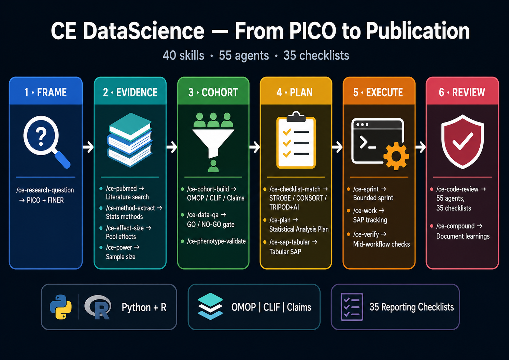

# Claude Code for Data Science

**Your AI research assistant — from research question to publication.**

40 skills. 55 review agents. 35 reporting checklists. Works with R and Python.

One plugin gives your coding agent the entire biomedical research lifecycle: frame your PICO, search PubMed, build cohorts, write your SAP, execute with tracking, review against STROBE/CONSORT/TRIPOD+AI, and document what you learned so the next study is easier.



---

## Get started in 5 minutes

### 1. Install Bun

```bash
curl -fsSL https://bun.sh/install | bash
```

### 2. Clone and install

```bash
git clone https://github.com/sajor2000/ce-datascience.git
cd ce-datascience
bun install
```

### 3. Launch

```bash
claude --plugin-dir ~/ce-datascience/plugins/ce-datascience
```

**Pro tip** — save yourself typing forever:

```bash
echo 'alias claude-ds="claude --plugin-dir ~/ce-datascience/plugins/ce-datascience"' >> ~/.zshrc
source ~/.zshrc
```

Now just type `claude-ds` in any project.

### 4. Configure your stack

```
/ce-setup
```

Picks up your language (R or Python), IDE, libraries, and data layer automatically.

### 5. See your workflow

```
/ce-workflow
```

Shows every step for your project type and tells you what to do next.

---

## What can it do?

### Run an observational study

```
/ce-research-question "sepsis bundles and 30-day mortality in ICU"
/ce-pubmed
/ce-method-extract
/ce-checklist-match
/ce-effect-size
/ce-power
/ce-cohort-build
/ce-data-qa
/ce-plan
/ce-sap-tabular
/ce-sprint
/ce-work
/ce-verify
/ce-code-review
/ce-compound
```

### Build a prediction model

```
/ce-research-question
/ce-checklist-match
/ce-cohort-build
/ce-plan
/ce-ml-experiment-track
/ce-optimize
/ce-work
/ce-model-card
/ce-code-review
```

### Work with CLIF consortium data

```
# Activates automatically — enforces Parquet, mCIDE vocab, three-script architecture
/ce-workflow
/ce-work
```

### Analyze omics data

```
/ce-bioinfo-qc
/ce-genome-build
/ce-plan
/ce-work
/ce-code-review
```

### Ship a software fix

```
/ce-brainstorm
/ce-plan
/ce-work
/ce-code-review
```

---

## Works with your stack

| Stack | IDE | Output | Libraries |
|---|---|---|---|
| **Python + Jupyter** | JupyterLab, VS Code | `.ipynb` | pandas, polars, scipy, statsmodels, scikit-learn |
| **Python + Marimo** | Marimo, VS Code | reactive `.py` | pandas, polars, scipy, statsmodels, scikit-learn |
| **R** | RStudio, VS Code | Quarto `.qmd`, `.Rmd` | tidyverse, data.table, survival, lme4, gt, tidymodels |

## Knows your data layer

| Data layer | How it activates | What it does |
|---|---|---|
| **OMOP CDM** | SQL with `cdm_source`, `concept`, `person` | OMOP SQL + concept sets, vocabulary pinning |
| **CLIF** | `CLIF_CLAUDE.md` or `clif-consortium` remote | Parquet-only, mCIDE vocab, POC sign-off |
| **Admin claims** | Medicare/Medicaid/MarketScan in code | Enrollment gaps, NDC-to-RxNorm, claims reviewer |
| **Custom EHR** | Default | PHI scanning, generic cohort building |
| **Bioinformatics** | `.fastq`, `.bam`, `Snakefile` | FastQC/MultiQC, genome build, batch-effect screen |

## Reviews against 35 checklists

| Study type | Primary | Extensions |
|---|---|---|
| Observational cohort | STROBE | RECORD, RECORD-PE, STROBE-MR, STREGA |
| Randomized trial | CONSORT | CONSORT-AI, SPIRIT-AI, Cluster, Adaptive, N-of-1 |
| Prediction model | TRIPOD, TRIPOD+AI | CHARMS |
| Diagnostic accuracy | STARD, STARD-AI | CLAIM, QUADAS-2 |
| Systematic review | PRISMA | DTA, NMA, IPD, ScR |
| Target trial emulation | TARGET | |
| Other | SQUIRE, GRAMMS, STaRT-RWE, ARRIVE, CARE, CHART, CHEERS, COREQ, DEAL, PDSQI, REFORMS | |

---

## Also works with Codex, Pi, Gemini, and more

| Platform | Install command (run from `~/ce-datascience`) |
|---|---|
| Codex | `bun run src/index.ts install ./plugins/ce-datascience --to codex` |
| Pi | `bun run src/index.ts install ./plugins/ce-datascience --to pi` |
| Gemini CLI | `bun run src/index.ts install ./plugins/ce-datascience --to gemini` |
| OpenCode | `bun run src/index.ts install ./plugins/ce-datascience --to opencode` |
| Kiro | `bun run src/index.ts install ./plugins/ce-datascience --to kiro` |
| All at once | `bun run src/index.ts install ./plugins/ce-datascience --to all` |

Pi also needs `pi install npm:pi-subagents` first.

---

## Updating

```bash
cd ~/ce-datascience && git pull && bun install
```

Then restart your coding agent.

---

## Troubleshooting

**"Unknown command" on /ce-setup:** Restart Claude Code. The plugin loads at session start.

**`bun install` fails:** Run `bun --version`. If missing: `curl -fsSL https://bun.sh/install | bash`

**Plugin seems outdated:** `cd ~/ce-datascience && git pull && bun install`, then restart.

**CLIF activating on a non-CLIF project:** `/ce-clif --off` disables it for the session.

---

## Full inventory

| | Count |
|---|---|
| Skills | 40 |
| Agents | 55 |
| Reporting checklists | 35 |

[See every skill and agent](plugins/ce-datascience/README.md)

---

## Built on

Fork of [compound-engineering](https://github.com/EveryInc/compound-engineering-plugin) by [Kieran Klaassen](https://github.com/kieranklaassen) at [Every](https://every.to). Also influenced by [BMAD Method](https://github.com/bmad-code-org/BMAD-METHOD) and [Superpowers](https://github.com/obra/superpowers).

## License

[MIT](LICENSE) — Copyright (c) 2026 Juan Carlos Rojas. Original compound-engineering Copyright (c) 2025 Every.
