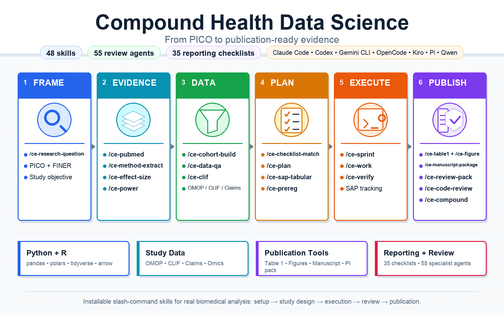

# Compound Health Data Science

**Your AI research assistant — from research question to publication.**

48 skills. 55 review agents. 35 reporting checklists. R and Python. Works with Claude Code, Codex, Pi, Gemini CLI, OpenCode, Kiro, and Qwen Code.

One plugin gives your coding agent the entire biomedical research lifecycle: frame your PICO, search PubMed, build cohorts, write your SAP, execute with tracking, review against STROBE/CONSORT/TRIPOD+AI, and document what you learned so the next study is easier.



---

## Get started in 5 minutes

For a complete copy-paste setup guide across every supported platform, see
[docs/setup.md](docs/setup.md).

### Locked-down or demo laptop

Use the offline release artifacts when package managers, GitHub CLI, Git, Bun,
or Quarto are blocked by IT policy. Basic Claude Code and Codex use does not
require Bun, GitHub CLI, or Quarto.

Claude Code can load the approved plugin folder or ZIP directly:

```bash
claude --plugin-dir /approved/path/ce-datascience
claude --plugin-dir /approved/path/ce-datascience.zip
```

Native Claude plugin skills are namespaced:

```text
/ce-datascience:ce-setup --locked-down
/ce-datascience:ce-workflow
```

Bare `/ce-*` commands are an optional local alias layer, not a native plugin
guarantee. Install them only when you want demo-friendly command names:

```bash
bash scripts/install/install-claude-aliases.sh --plugin-dir /approved/path/ce-datascience --scope user
```

For Codex without Bun, unpack `ce-datascience-codex-local.zip` and run:

```bash
bash install-codex-offline.sh --source /approved/path/ce-datascience-codex-local --codex-home "${CODEX_HOME:-$HOME/.codex}"
```

Restart Codex, open `/plugins`, install CE DataScience from the local
marketplace, then restart again. The installer writes the personal marketplace
file under `.agents/plugins/marketplace.json` and points it at
`./.codex/plugins/ce-datascience` relative to that marketplace root.

### Source checkout for contributors

Bun and Git are contributor/release tooling. Install them only when you need to
build, validate, or convert the plugin from source:

```bash
curl -fsSL https://bun.sh/install | bash
export CE_DS_REPO="$HOME/ce-datascience"
git clone https://github.com/sajor2000/ce-datascience.git "$CE_DS_REPO"
cd "$CE_DS_REPO"
bun install
```

Launch Claude Code from the checkout:

```bash
claude --plugin-dir "$CE_DS_REPO/plugins/ce-datascience"
```

**Pro tip** — save yourself typing forever:

```bash
printf "\nalias claude-ds='claude --plugin-dir %s/plugins/ce-datascience'\n" "$CE_DS_REPO" >> ~/.zshrc
source ~/.zshrc
```

Now just type `claude-ds` in any project.

### Configure your stack

```text
/ce-datascience:ce-setup
```

Picks up your language (R or Python), IDE, libraries, and data layer automatically.
If you installed optional aliases, `/ce-setup` works too.

### See your workflow

```text
/ce-datascience:ce-workflow
```

Shows every step for your project type and tells you what to do next.

---

## What can it do?

The examples below use bare `/ce-*` commands for readability. In native Claude
plugin installs, use `/ce-datascience:ce-*` unless local aliases are installed.

### Run an observational study

```
/ce-research-question "sepsis bundles and 30-day mortality in ICU"
/ce-pubmed
/ce-method-extract
/ce-checklist-match
/ce-effect-size
/ce-power
/ce-cohort-build
/ce-data-qa
/ce-plan
/ce-sap-tabular
/ce-sprint
/ce-work
/ce-verify
/ce-code-review
/ce-compound
```

### Build a prediction model

```
/ce-research-question
/ce-checklist-match
/ce-cohort-build
/ce-plan
/ce-ml-experiment-track
/ce-optimize
/ce-work
/ce-model-card
/ce-code-review
```

### Work with CLIF consortium data

```
# Activates automatically — enforces Parquet, mCIDE vocab, three-script architecture
/ce-workflow
/ce-work
```

### Analyze omics data

```
/ce-bioinfo-qc
/ce-genome-build
/ce-plan
/ce-work
/ce-code-review
```

### Ship a software fix

```
/ce-brainstorm
/ce-plan
/ce-work
/ce-code-review
```

### Maintain the plugin professionally

```
/ce-sessions
/ce-resolve-pr-feedback
/ce-release-notes
/ce-report-bug
```

These workflow utilities are adapted from the original compound-engineering plugin so the public plugin can support release questions, bug reports, cross-session debugging, and statistical-methodology PR feedback without pulling in unrelated Rails, frontend, Xcode, Slack, product-pulse, dogfood, LFG, or agent-native workflows.

---

## Works with your stack

| Stack | IDE | Output | Libraries |
|---|---|---|---|
| **Python + Jupyter** | JupyterLab, VS Code | `.ipynb` | pandas, polars, scipy, statsmodels, scikit-learn |
| **Python + Marimo** | Marimo, VS Code | reactive `.py` | pandas, polars, scipy, statsmodels, scikit-learn |
| **R** | RStudio, VS Code | Quarto `.qmd`, `.Rmd` | tidyverse, data.table, survival, lme4, gt, tidymodels |

## Knows your data layer

| Data layer | How it activates | What it does |
|---|---|---|
| **OMOP CDM** | SQL with `cdm_source`, `concept`, `person` | OMOP SQL + concept sets, vocabulary pinning |
| **CLIF** | `CLIF_CLAUDE.md` or `clif-consortium` remote | Parquet-only, mCIDE vocab, POC sign-off |
| **Admin claims** | Medicare/Medicaid/MarketScan in code | Enrollment gaps, NDC-to-RxNorm, claims reviewer |
| **Custom EHR** | Default | PHI scanning, generic cohort building |
| **Bioinformatics** | `.fastq`, `.bam`, `Snakefile` | FastQC/MultiQC, genome build, batch-effect screen |

## Upstream CE features now included

This fork tracks useful infrastructure and workflow improvements from the original [compound-engineering](https://github.com/EveryInc/compound-engineering-plugin) plugin while keeping the product scoped to health data science.

| Area | What changed for data scientists |
|---|---|
| Planning and brainstorming | `/ce-plan` keeps SAP/implementation dual mode and now supports upstream output modes, HTML/Markdown rendering references, format-preserving resume, stronger synthesis, external-research routing, and conceptual-diagram affordances. `/ce-brainstorm` keeps study-design framing while adding grouped requirements, output-mode handling, and visual communication behavior. |
| PR and review workflow | `/ce-resolve-pr-feedback` carries upstream GraphQL pagination and split-reference handling, then restores statistical methodology and SAP-aware response language. `/ce-code-review`, `/ce-doc-review`, `/ce-commit`, and `/ce-commit-push-pr` include shared workflow fixes where they improve review, commit, and PR hygiene. |
| Session history | `/ce-sessions` uses upstream cross-platform discovery improvements for Claude Code, Codex, and Cursor sessions, with repo-root pre-resolution and structured extraction scripts. |
| Distribution and installation | The converter supports current `ce-*.md` agent source files while still parsing legacy `*.agent.md`, respects `CODEX_HOME`, writes Codex roots correctly, and manages `.codex/hooks.json` without clobbering manual hooks. |
| Public support | `/ce-release-notes` and `/ce-report-bug` are included as curated support skills for a professional public plugin surface. |

## Reviews against 35 checklists

| Study type | Primary | Extensions |
|---|---|---|
| Observational cohort | STROBE | RECORD, RECORD-PE, STROBE-MR, STREGA |
| Randomized trial | CONSORT | CONSORT-AI, SPIRIT-AI, Cluster, Adaptive, N-of-1 |
| Prediction model | TRIPOD, TRIPOD+AI | CHARMS |
| Diagnostic accuracy | STARD, STARD-AI | CLAIM, QUADAS-2 |
| Systematic review | PRISMA | DTA, NMA, IPD, ScR |
| Target trial emulation | TARGET | |
| Other | SQUIRE, GRAMMS, STaRT-RWE, ARRIVE, CARE, CHART, CHEERS, COREQ, DEAL, PDSQI, REFORMS | |

---

## Also works with Codex, Pi, Gemini, and more

Run generated installs from the repo root (`cd "$CE_DS_REPO"`). Use
`./plugins/ce-datascience` with the leading `./` for local installs.

| Platform | Easiest command |
|---|---|
| Claude Code | `claude --plugin-dir "$CE_DS_REPO/plugins/ce-datascience"` then `/ce-datascience:ce-setup` |
| Claude Code, offline | `claude --plugin-dir /approved/path/ce-datascience.zip` |
| Claude bare aliases | `bash scripts/install/install-claude-aliases.sh --plugin-dir "$CE_DS_REPO/plugins/ce-datascience" --scope user` |
| Codex native + agent bridge | `bun run src/index.ts install ./plugins/ce-datascience --to codex --codex-home "$CODEX_HOME"` |
| Codex offline local marketplace | `bash install-codex-offline.sh --source /approved/path/ce-datascience-codex-local --codex-home "$CODEX_HOME"` |
| Codex standalone | `bun run src/index.ts install ./plugins/ce-datascience --to codex --codex-home "$CODEX_HOME" --include-skills` |
| Pi | `bun run src/index.ts install ./plugins/ce-datascience --to pi --pi-home "$HOME/.pi/agent"` |
| Gemini CLI | `bun run src/index.ts install ./plugins/ce-datascience --to gemini --output /path/to/gemini-workspace` |
| OpenCode | `bun run src/index.ts install ./plugins/ce-datascience --to opencode --output /path/to/workspace` |
| Kiro | `bun run src/index.ts install ./plugins/ce-datascience --to kiro --output /path/to/kiro-workspace` |
| Qwen Code | `qwen extensions install sajor2000/ce-datascience:ce-datascience` |
| All generated targets | `bun run src/index.ts install ./plugins/ce-datascience --to all` |

Pi also needs `pi install npm:pi-subagents` first.
Qwen Code uses its native extension installer; it is not a generated `--to qwen` converter target. `--to all` only writes generated targets detected on the machine and skips native-only plugin ecosystems.

For a non-default Codex profile, point both Codex and the installer at the same root:

```bash
export CODEX_HOME="$HOME/.codex/profiles/research"
codex plugin marketplace add "$CE_DS_REPO"
cd "$CE_DS_REPO"
bun run src/index.ts install ./plugins/ce-datascience --to codex --codex-home "$CODEX_HOME"
CODEX_HOME="$CODEX_HOME" codex
```

Inside Codex, run `/plugins`, select this local marketplace, install `ce-datascience`, then restart. Codex's native plugin install provides the skills; the Bun command above adds generated agents until Codex supports plugin-defined agents natively.

Codex installs have two supported modes:

- **Native plugin + agent bridge (recommended):** install the plugin inside Codex with `/plugins`, then run `install --to codex --codex-home "$CODEX_HOME"` to add generated agents to the same profile.
- **Standalone generated install:** run `bun run src/index.ts install ./plugins/ce-datascience --to codex --codex-home "$CODEX_HOME" --include-skills` when native plugin install is unavailable. This writes generated skills, MCP config, and managed `.codex/hooks.json` entries.

Managed Codex hooks are tagged with plugin metadata so upgrades can replace this plugin's hook entries without deleting manual hooks or hooks owned by another plugin. If an existing `hooks.json` is malformed, the installer backs it up before writing a managed replacement.

See [Codex profile and hook installation](docs/solutions/integrations/codex-profile-and-hook-installation.md) for the profile, standalone, and recovery details.
See [the setup guide](docs/setup.md) for exact Claude, Codex, OpenCode, Gemini, Kiro, Pi, and Qwen walkthroughs.

---

## Updating

```bash
cd ~/ce-datascience && git pull && bun install
```

Then restart your coding agent.

To build corporate/offline ZIPs from a source checkout:

```bash
bun run package:corporate
```

---

## Troubleshooting

**"Unknown command" on `/ce-setup`:** Native Claude plugin commands are namespaced. Use `/ce-datascience:ce-setup`, or install the optional local aliases into `.claude/commands`.

**`bun install` fails:** Run `bun --version`. If missing: `curl -fsSL https://bun.sh/install | bash`

**Corporate laptop blocks Bun, GitHub CLI, Git, or Quarto:** Use the offline Claude folder/ZIP or Codex local marketplace package. Bun and Git are for source builds; GitHub CLI is only for GitHub helpers; Quarto is only required for Quarto render/manuscript workflows.

**Plugin seems outdated:** `cd ~/ce-datascience && git pull && bun install`, then restart.

**Codex installed into the wrong profile:** Set `CODEX_HOME` on both the `codex` command and the Bun installer. The installer defaults to `$CODEX_HOME` when set, otherwise `~/.codex`.

**Codex hooks stopped loading after a broken edit:** Re-run the standalone install with `--include-skills`. The installer backs up malformed `.codex/hooks.json` before writing managed hook entries.

**CLIF activating on a non-CLIF project:** `/ce-clif --off` disables it for the session.

---

## Full inventory

| | Count |
|---|---|
| Skills | 48 |
| Agents | 55 |
| Reporting checklists | 35 |

[See every skill and agent](plugins/ce-datascience/README.md)

---

## Built on

Fork of [compound-engineering](https://github.com/EveryInc/compound-engineering-plugin) by [Kieran Klaassen](https://github.com/kieranklaassen) at [Every](https://every.to). Also influenced by [BMAD Method](https://github.com/bmad-code-org/BMAD-METHOD) and [Superpowers](https://github.com/obra/superpowers).

## License

[MIT](LICENSE) — Copyright (c) 2026 Juan Carlos Rojas. Original compound-engineering Copyright (c) 2025 Every.
