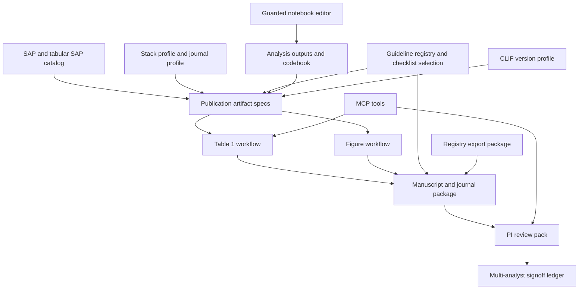

# feat: Add publication and collaboration workflows to ce-datascience

## Summary

Add the next feature layer after platform hardening: publication-ready table and figure workflows, manuscript/journal package generation, PI-facing review packs, multi-analyst signoff, safer existing-notebook modification, stronger registry export packages, CLIF guidance refresh, and an evidence gate for SAS/Stata support. The work should extend existing SAP, tabular-output, guideline-registry, verification, and MCP patterns rather than creating a separate manuscript product.

---

## Problem Frame

`ce-datascience` now covers the core computational research loop: study design, SAP creation, tabular SAP companion, data QA, analysis execution, code review, reporting checklist compliance, preregistration form drafts, and MCP access. The remaining practical gap is the end of the research lifecycle: users still need to convert reviewed analysis outputs into publication-grade tables, journal figures, manuscript packages, PI review artifacts, and registry-ready submission packages without losing SAP traceability or data-governance protections.

The origin requirements explicitly deferred Table 1 and publication figure generation, manuscript drafting, multi-site / multi-analyst workflows, stronger registry integration, notebook modification, SAS/Stata support, and CLIF version refresh. This plan brings those deferred features back only where the current plugin already has enough foundation to implement them safely.

---

## Requirements

**Publication Outputs**

- R1. Generate publication-ready Table 1 artifacts from the SAP, tabular SAP output catalog, codebook, stack profile, and available analysis outputs without inventing variables or cohorts.
- R2. Generate journal-style figure specifications and export-ready figure packages that preserve source-data traceability, visual quality checks, and reporting-guideline links.
- R3. Validate tables and figures against manuscript/journal rules where those rules are explicit, while keeping journal-specific style as configurable profiles rather than hard-coded defaults.

**Manuscript and Journal Packages**

- R4. Generate manuscript package scaffolds that connect SAP sections, output catalogs, reporting checklists, model cards, preregistration outputs, tables, figures, references, and reproducibility appendices.
- R5. Support Quarto-first package generation while preserving RMarkdown, Jupyter, marimo, and script-based projects through fallback package manifests and generated copy/paste-ready sections.
- R6. Produce submission manifests that distinguish main manuscript files, tables, figures, supplements, checklists, registry documents, and reproducibility files.

**Collaboration and Signoff**

- R7. Produce PI-facing review packs that summarize what changed, what outputs are ready, what needs signoff, and where SAP deviations or unresolved findings remain.
- R8. Add multi-analyst signoff artifacts for SAP locks, data locks, sprint closeouts, Table 1 readiness, figure readiness, manuscript package readiness, and registry package readiness.
- R9. Keep signoff files append-only or audit-friendly, and ensure no workflow silently marks scientific content approved without a named human reviewer.

**Notebook and Language Coverage**

- R10. Add guarded existing-notebook modification support for `.ipynb` while continuing to prefer text-native Quarto, RMarkdown, marimo, scripts, and paired percent-format scripts when practical.
- R11. Validate notebook edits with structured notebook parsing, round-trip preservation, backup files, and clear refusal behavior for unsafe notebook states.
- R12. Add an evidence-gated SAS/Stata support decision path that inventories stable project patterns and proposes review/scaffolding boundaries before any full code-generation promise.

**Registry and CLIF**

- R13. Harden `ce-prereg` into registry-specific export packages for OSF, ClinicalTrials.gov, PROSPERO, and AsPredicted, with validation reports and human-submission instructions rather than automated submission.
- R14. Refresh CLIF guidance and references to current official CLIF, CLIFpy, CLIF project-template, and MIMIC-to-CLIF release state, and add checks that keep downstream skills aligned with selected CLIF data dictionary versions.
- R15. Expose durable feature outputs through MCP only when project-root isolation, path safety, and optional dependency messages meet the hardening standard already established for MCP tools.

---

## Origin Trace

This plan extends the origin research lifecycle without reopening the already-shipped core loop:

- Origin F2 and F3 established SAP creation, SAP-code tracking, and tabular output ownership. R1-R6 build publication outputs and manuscript packages on those contracts rather than replacing them.
- Origin A2 and F4 established PI/study-lead review as an indirect but important consumer. R7-R9 add review packs and signoff so that scientific approval can be visible without making the PI operate the agent harness directly.
- Origin R10 explicitly deferred existing-notebook modification beyond generation-only flows. R10-R11 bring that gap back with parser-backed safety gates.
- Origin R23 named SAS/Stata as stretch-goal support. R12 keeps that support evidence-gated instead of promising unsupported code generation.
- Origin deferred items named ClinicalTrials.gov integration, manuscript drafting, multi-site / multi-analyst coordination, data quality profiling, Table 1, and publication figures. R1-R14 cover the now-actionable portions while keeping automated registry submission, full manuscript prose drafting, and full SAS/Stata generation deferred.
- Origin AE1-AE5 remain preserved: stack-profile routing, SAP drift, reporting review, and PICO/PECO study framing are not replaced by these publication workflows.

---

## Key Technical Decisions

- KTD1. **Build additive workflow skills, not one manuscript mega-skill.** Table generation, figure packaging, manuscript assembly, review packs, notebook editing, registry packaging, and CLIF refresh have distinct failure modes and validation surfaces. Separate skills keep trigger behavior clear and make rollout safer.
- KTD2. **Use the tabular SAP output catalog as the contract.** `ce-sap-tabular` already declares output files, interpretations, variables, and analysis ownership. Publication workflows should consume and validate that contract before generating tables or manuscript packages instead of scraping arbitrary output folders first.
- KTD3. **Keep registry workflows human-submission first.** ClinicalTrials.gov PRS, OSF registrations, and PROSPERO all involve accounts, owner roles, review-team approval, or web-form workflows. The plugin should generate validated packages and checklists, not handle credentials or submit records.
- KTD4. **Make Quarto the richest manuscript path, with portable fallbacks.** Quarto manuscripts can produce HTML, PDF, Docx, notebook views, and publisher-oriented archives, so it should be the first-class package target. Non-Quarto projects still get manifests, tables, figures, checklists, and manuscript section drafts.
- KTD5. **Treat `.ipynb` mutation as a guarded utility.** The official notebook format is JSON with optional metadata and mixed string/list source fields. Direct string editing is too fragile; implementation should use a parser-backed helper, validate after mutation, and create recoverable backups.
- KTD6. **Source journal-style behavior from profiles.** JAMA-style rules are valuable defaults for clinical research figures and tables, but the plugin should structure style as profiles so users can later add NEJM, Lancet, BMJ, specialty journals, or institutional templates without rewriting generators.
- KTD7. **SAS/Stata support starts with discovery and review boundaries.** Existing requirements only name SAS/Stata as a stretch goal. This plan should add an evidence gate and reviewer/scaffold decision record first; full scaffolding should wait until stable patterns are documented.
- KTD8. **MCP exposure follows project-root isolation.** New MCP tools may be useful for package generation and signoff reports, but only if they write to user project roots and keep bundled templates under the immutable plugin asset root.

---

## High-Level Technical Design

The main design shape is a traceable artifact pipeline: source study contracts feed artifact specifications; artifact specifications feed generated tables, figures, registry packages, and manuscript packages; review packs and signoff ledgers sit at the handoff points. The notebook editor and MCP tools are supporting surfaces, not independent product lines.

---

## Implementation Units

### U1. Publication Artifact Registry and Style Profiles

**Goal:** Add a shared source of truth for publication artifact types, journal/style profiles, required metadata, and validation rules used by downstream publication workflows.

**Requirements:** R1, R2, R3, R4, R6

**Dependencies:** None

**Files:**

- Create: `plugins/ce-datascience/shared/publication-artifact-registry.yaml`
- Create: `plugins/ce-datascience/shared/journal-style-profiles.yaml`
- Modify: `plugins/ce-datascience/README.md`
- Modify: `tests/plugin-content-portability.test.ts`
- Create: `tests/publication-artifact-registry.test.ts`

**Approach:** Define artifact categories for `table1`, `analysis-table`, `figure`, `manuscript`, `supplement`, `checklist`, `registry-package`, `review-pack`, and `signoff-ledger`. Define style profiles initially for `jama` and `generic-biomedical`, with fields for table formatting, figure export expectations, typography, captions, file formats, and source-data requirements. Keep profiles declarative so skills and MCP tools can read the same data without copying rules into prose.

**Patterns to follow:** `plugins/ce-datascience/skills/ce-code-review/references/guideline-registry.yaml` for registry shape; `docs/solutions/integrations/mcp-project-root-and-guideline-registry.md` for machine-readable source-of-truth expectations.

**Test scenarios:**

- Given the registry names each artifact category, loading it in a test returns unique ASCII keys and required fields for each category.
- Given the `jama` profile, validation confirms it includes table, figure, caption, and file-format sections.
- Given README references the number or names of publication profiles, the parity test fails if the shared registry drifts from README claims.
- Given a profile references a template path, the path exists under the plugin source and is not absolute.

**Verification:** Registry tests pass, README claims match registry content, and release validation remains green.

### U2. Table 1 Generation Skill and Helpers

**Goal:** Add `/ce-table1` to generate baseline-characteristics tables in CSV, Markdown, and optionally XLSX/DOCX-ready forms from SAP variables, cohort definitions, and analysis outputs.

**Requirements:** R1, R3, R6, R7

**Dependencies:** U1

**Files:**

- Create: `plugins/ce-datascience/skills/ce-table1/SKILL.md`
- Create: `plugins/ce-datascience/skills/ce-table1/references/table1-spec.md`
- Create: `plugins/ce-datascience/skills/ce-table1/references/jama-table-rules.md`
- Create: `plugins/ce-datascience/skills/ce-table1/scripts/generate_table1.py`
- Modify: `plugins/ce-datascience/skills/ce-work/references/scaffolding-templates.md`
- Modify: `plugins/ce-datascience/README.md`
- Modify: `tests/frontmatter.test.ts`
- Modify: `tests/plugin-content-portability.test.ts`
- Create: `tests/table1-generator.test.ts`

**Approach:** The skill should read `analysis/sap.md`, `analysis/sap-tables/03-variables.csv`, `analysis/sap-tables/02-outputs.csv`, and optional user-provided summary files. It should refuse to invent baseline variables when the SAP/catalog is missing and instead prompt for the missing variable list. The helper should generate skeleton outputs and validation reports; computation-heavy statistics can be emitted as R/Python scaffolding when raw data are not available to the agent.

**Execution note:** Start with characterization tests for generated file shape and validation failures before expanding output formats.

**Patterns to follow:** `plugins/ce-datascience/skills/ce-sap-tabular/SKILL.md` for 5-table contract generation; `plugins/ce-datascience/skills/ce-sap-tabular/scripts/generate-tabular-sap.py` for optional XLSX generation with actionable dependency messages; `plugins/ce-datascience/skills/ce-verify/references/check-catalog.md` for figure/table quality gate language.

**Test scenarios:**

- Given a minimal SAP and variables catalog, running the helper produces a Table 1 spec with expected strata, rows, and file names.
- Given no SAP and no variables catalog, the skill instructions require prompting rather than fabricating variables.
- Given `openpyxl` is missing, the helper exits successfully for CSV/Markdown outputs and reports that XLSX output is skipped with install guidance.
- Given a CLIF profile is active, Table 1 guidance excludes protected patient-level output and respects aggregate-only `output/` rules.
- Given a JAMA style profile, generated labels use count/percent and uncertainty fields consistent with the profile.

**Verification:** `tests/table1-generator.test.ts`, frontmatter tests, portability tests, and release validation pass.

### U3. Publication Figure Workflow

**Goal:** Add `/ce-figure` to create figure specs, source-data manifests, export checks, and journal-style validation for generated scientific figures.

**Requirements:** R2, R3, R4, R6

**Dependencies:** U1

**Files:**

- Create: `plugins/ce-datascience/skills/ce-figure/SKILL.md`
- Create: `plugins/ce-datascience/skills/ce-figure/references/figure-spec.md`
- Create: `plugins/ce-datascience/skills/ce-figure/references/jama-figure-style.md`
- Create: `plugins/ce-datascience/skills/ce-figure/scripts/validate_figure_manifest.py`
- Modify: `plugins/ce-datascience/skills/ce-verify/references/check-catalog.md`
- Modify: `plugins/ce-datascience/agents/ce-r-pipeline-reviewer.md`
- Modify: `plugins/ce-datascience/agents/ce-python-ds-reviewer.md`
- Modify: `plugins/ce-datascience/README.md`
- Create: `tests/figure-workflow.test.ts`

**Approach:** The workflow should generate or validate a figure manifest that includes figure title, SAP section, source data path, source code path, output file path, caption, alt text, style profile, and export format. It should not promise to visually inspect images automatically in every platform; instead it should require the agent to inspect generated images when the harness supports image viewing and otherwise emit a validation checklist.

**Patterns to follow:** `plugins/ce-datascience/skills/ce-verify/references/check-catalog.md` for JAMA visual QA; `plugins/ce-datascience/agents/ce-quarto-render-reviewer.md` for render-time manuscript and figure correctness; `plugins/ce-datascience/skills/ce-code-review/references/*-checklist.md` for guideline-linked figure evidence.

**Test scenarios:**

- Given a figure manifest with missing source data, validation fails with a clear path-specific message.
- Given a manifest with duplicate figure numbers, validation fails before packaging.
- Given a figure linked to a SAP section and checklist item, validation preserves those links in the generated report.
- Given unsupported native statistical-software figure files, the skill requests vector/raster export files rather than packaging native-only files.
- Given figure output exists but caption or alt text is missing, validation reports a manuscript-readiness warning.

**Verification:** Figure manifest tests pass and reviewers route figure-diff changes to the relevant render, PHI, and language-specific reviewers.

### U4. Manuscript and Journal Package Skill

**Goal:** Add `/ce-manuscript-package` to assemble journal-ready package scaffolds from SAP, output catalog, tables, figures, checklists, references, model cards, and preregistration artifacts.

**Requirements:** R4, R5, R6, R13

**Dependencies:** U1, U2, U3

**Files:**

- Create: `plugins/ce-datascience/skills/ce-manuscript-package/SKILL.md`
- Create: `plugins/ce-datascience/skills/ce-manuscript-package/references/package-manifest-schema.yaml`
- Create: `plugins/ce-datascience/skills/ce-manuscript-package/references/quarto-manuscript-template.md`
- Create: `plugins/ce-datascience/skills/ce-manuscript-package/references/journal-package-checklist.md`
- Create: `plugins/ce-datascience/skills/ce-manuscript-package/scripts/build_package_manifest.py`
- Modify: `plugins/ce-datascience/skills/ce-model-card/SKILL.md`
- Modify: `plugins/ce-datascience/skills/ce-checklist-match/SKILL.md`
- Modify: `plugins/ce-datascience/README.md`
- Create: `tests/manuscript-package.test.ts`

**Approach:** Quarto projects get the richest scaffold: `manuscript/`, `_quarto.yml`, manuscript source, tables, figures, supplement manifest, checklist files, and a package manifest. Non-Quarto projects get a structured package manifest plus generated section drafts and file staging instructions. The skill should create no fake scientific prose; it should wire known sections and surface missing content.

**Patterns to follow:** `plugins/ce-datascience/agents/ce-quarto-render-reviewer.md` for Quarto pitfalls; `plugins/ce-datascience/skills/ce-model-card/SKILL.md` for model-card integration; Quarto's manuscript model for multi-format outputs and linked notebooks.

**Test scenarios:**

- Given a Quarto stack profile and available table/figure manifests, package manifest generation includes manuscript, tables, figures, supplements, checklist, registry, and reproducibility sections.
- Given missing Table 1 or figure manifests, the package skill reports blockers rather than generating a misleading complete package.
- Given a Jupyter-first project, package generation creates a manifest and manuscript section stubs without trying to rewrite notebooks into Quarto unless the user requests conversion.
- Given a prediction-model SAP, the package requires or links a model card.
- Given selected reporting guidelines, package generation includes the matching checklist file paths from the guideline registry.

**Verification:** Manifest tests pass and generated package references are repo-relative.

### U5. PI Review Pack and Multi-Analyst Signoff

**Goal:** Add `/ce-review-pack` and a shared signoff ledger so study leads can review ready outputs, unresolved issues, SAP deviations, and required approvals without reading raw code or agent transcripts.

**Requirements:** R7, R8, R9

**Dependencies:** U1, U2, U3, U4

**Files:**

- Create: `plugins/ce-datascience/skills/ce-review-pack/SKILL.md`
- Create: `plugins/ce-datascience/skills/ce-review-pack/references/review-pack-template.md`
- Create: `plugins/ce-datascience/skills/ce-review-pack/references/signoff-ledger-schema.yaml`
- Create: `plugins/ce-datascience/skills/ce-review-pack/scripts/validate_signoff_ledger.py`
- Modify: `plugins/ce-datascience/skills/ce-sprint/SKILL.md`
- Modify: `plugins/ce-datascience/skills/ce-data-qa/SKILL.md`
- Modify: `plugins/ce-datascience/skills/ce-verify/SKILL.md`
- Modify: `plugins/ce-datascience/skills/ce-work/references/sap-tracking.md`
- Modify: `plugins/ce-datascience/README.md`
- Create: `tests/review-pack-signoff.test.ts`

**Approach:** The review pack should be a human-readable markdown artifact plus a machine-readable signoff ledger. It should summarize SAP sections, generated outputs, review findings, data locks, preregistration state, table/figure readiness, manuscript package readiness, and named approvals. Signoff should be explicit and append-only where possible; edits to prior signoff entries should be flagged.

**Patterns to follow:** `plugins/ce-datascience/skills/ce-sprint/SKILL.md` for reviewer and scope discipline; `plugins/ce-datascience/skills/ce-data-qa/SKILL.md` for GO/NO-GO and PI signoff block; `plugins/ce-datascience/skills/ce-mcp-server/mcp_server/run.py` for data lock and compound learning artifacts.

**Test scenarios:**

- Given a closed sprint, Table 1 manifest, figure manifest, and code-review report, review-pack generation includes all ready outputs and unresolved blockers.
- Given a signoff ledger with duplicate approval IDs or edited prior entries, validation fails.
- Given no named reviewer, the skill refuses to mark package readiness as approved.
- Given SAP drift findings remain unresolved, the review pack marks manuscript readiness as blocked.
- Given CLIF mode is active, the pack includes aggregate-only and protected-path signoff checks.

**Verification:** Signoff validation tests pass, and package/readiness statuses are deterministic from available artifacts.

### U6. Guarded Existing-Notebook Modification

**Goal:** Add a guarded notebook-editing utility that allows agents to insert, replace, or annotate `.ipynb` cells safely when users work in Jupyter-first projects.

**Requirements:** R10, R11

**Dependencies:** U1

**Files:**

- Create: `plugins/ce-datascience/skills/ce-notebook-edit/SKILL.md`
- Create: `plugins/ce-datascience/skills/ce-notebook-edit/references/notebook-edit-policy.md`
- Create: `plugins/ce-datascience/skills/ce-notebook-edit/scripts/notebook_edit.py`
- Modify: `plugins/ce-datascience/skills/ce-work/references/scaffolding-templates.md`
- Modify: `plugins/ce-datascience/agents/ce-reproducibility-reviewer.md`
- Modify: `plugins/ce-datascience/agents/ce-phi-leak-reviewer.md`
- Modify: `plugins/ce-datascience/README.md`
- Create: `tests/notebook-edit.test.ts`

**Approach:** Use Python's `nbformat` package when installed; otherwise return actionable dependency guidance and suggest text-native alternatives. The helper should create a backup, load the notebook through a parser, preserve unknown metadata, apply requested cell operations by stable anchors or tags, validate the final notebook, and refuse edits when anchors are ambiguous. Skill prose should keep text-native formats as the default recommendation while supporting real users who already have notebooks.

**Execution note:** Implement parser-backed tests before connecting the utility to `/ce-work`.

**Patterns to follow:** `plugins/ce-datascience/skills/ce-work/references/scaffolding-templates.md` for first-class vs best-effort notebook support; `docs/solutions/integrations/platform-install-certification.md` for optional dependency failure text.

**Test scenarios:**

- Given a valid notebook and an unambiguous cell tag, inserting a markdown or code cell preserves notebook metadata and validates afterward.
- Given source fields stored as string lists, the helper reads and writes without corrupting content.
- Given an ambiguous anchor or missing tag, the helper refuses and leaves the original notebook unchanged.
- Given `nbformat` is missing, the script reports an actionable install command and exits without partial writes.
- Given a notebook contains outputs with potential PHI, the skill routes users through PHI review before packaging or committing outputs.

**Verification:** Notebook edit tests cover success, refusal, backup, and dependency-missing paths.

### U7. Registry Export Package Hardening

**Goal:** Upgrade `ce-prereg` from template text generation to validated registry export packages for OSF, ClinicalTrials.gov, PROSPERO, and AsPredicted.

**Requirements:** R13, R4, R6, R8

**Dependencies:** U1, U4, U5

**Files:**

- Modify: `plugins/ce-datascience/skills/ce-prereg/SKILL.md`
- Create: `plugins/ce-datascience/skills/ce-prereg/references/registry-export-schema.yaml`
- Modify: `plugins/ce-datascience/skills/ce-prereg/references/templates/osf-standard.md`
- Modify: `plugins/ce-datascience/skills/ce-prereg/references/templates/clinicaltrials.md`
- Modify: `plugins/ce-datascience/skills/ce-prereg/references/templates/prospero.md`
- Modify: `plugins/ce-datascience/skills/ce-prereg/references/templates/aspredicted.md`
- Create: `plugins/ce-datascience/skills/ce-prereg/scripts/validate_registry_package.py`
- Modify: `plugins/ce-datascience/README.md`
- Create: `tests/prereg-registry-package.test.ts`

**Approach:** Generate `analysis/prereg/<registry>/` packages containing a human-readable form draft, structured JSON, validation report, source SAP reference, signoff requirements, and "paste into registry" guidance. Do not add credential handling or submission APIs. ClinicalTrials.gov output should align with PRS/data-element concepts; OSF should preserve template selection; PROSPERO should account for team approval and eligibility constraints.

**Patterns to follow:** Existing `ce-prereg` registry mapping; `plugins/ce-datascience/skills/ce-review-pack/references/signoff-ledger-schema.yaml` after U5; official ClinicalTrials.gov PRS/user-guide and OSF/PROSPERO guidance.

**Test scenarios:**

- Given an unlocked SAP, registry package validation refuses to generate a final package.
- Given a ClinicalTrials.gov package missing sponsor, intervention, or outcome timeframe fields, validation reports registry-specific blockers.
- Given an OSF package for a secondary-data study, validation confirms the selected OSF template is represented and does not force the standard template.
- Given a PROSPERO package, validation records review-team approval needs and refuses unsupported review types when official eligibility rules are not satisfied.
- Given a final package, all paths are repo-relative and no credentials or account tokens are written.

**Verification:** Registry package tests pass and `ce-prereg` remains human-submission only.

### U8. CLIF Guidance Refresh and Version-Aware Checks

**Goal:** Refresh CLIF content against current CLIF official sources and make CLIF version selection visible to downstream publication, cohort, QA, and review workflows.

**Requirements:** R14, R1, R2, R7, R15

**Dependencies:** U1, U5

**Files:**

- Modify: `plugins/ce-datascience/skills/ce-clif/SKILL.md`
- Modify: `plugins/ce-datascience/skills/ce-clif/references/clif-rules.md`
- Modify: `plugins/ce-datascience/skills/ce-clif/references/clifpy-recipes.md`
- Modify: `plugins/ce-datascience/skills/ce-clif/references/r-template-recipes.md`
- Modify: `plugins/ce-datascience/skills/ce-cohort-build/SKILL.md`
- Modify: `plugins/ce-datascience/skills/ce-data-qa/SKILL.md`
- Modify: `plugins/ce-datascience/skills/ce-verify/SKILL.md`
- Modify: `plugins/ce-datascience/skills/ce-table1/SKILL.md`
- Modify: `plugins/ce-datascience/README.md`
- Create: `tests/clif-guidance.test.ts`

**Approach:** Update the CLIF default, version notes, and recipe references based on official CLIF and CLIF-MIMIC sources. Add version-aware warnings when selected CLIF data dictionary versions do not match current public guidance. Ensure downstream workflows parse and preserve `__CE_CLIF__ active=true version=<dd-version>` and do not hard-code stale defaults.

**Patterns to follow:** Existing `ce-clif` signal design; `plugins/ce-datascience/skills/ce-plan/references/sap-mode-workflow.md` for CLIF profile behavior under SAP mode; `docs/solutions/integrations/platform-install-certification.md` for current-source verification discipline.

**Test scenarios:**

- Given `__CE_CLIF__ active=true version=2.1.0`, downstream skill prose routes to version-aware guidance without overwriting the user-selected version.
- Given CLIF docs mention a default version, tests fail if README and `ce-clif` disagree.
- Given a CLIF workflow tries to generate patient-level output under `output/`, Table 1/review-pack guidance blocks it.
- Given official source links are refreshed, references remain stable URLs and are not local machine paths.
- Given ambiguous CLIF signals, `ce-clif` still asks before activation rather than silently applying CLIF rules to generic EHR projects.

**Verification:** CLIF guidance tests and portability tests pass; external source dates are recorded in a solution note if the refresh changes durable policy.

### U9. MCP Tools for Publication Artifacts and Signoff

**Goal:** Expose high-value publication artifact generation and validation through MCP without repeating the project-root bug fixed during technical hardening.

**Requirements:** R15, R1, R5, R7, R8, R13

**Dependencies:** U1, U2, U3, U5, U7

**Files:**

- Modify: `plugins/ce-datascience/skills/ce-mcp-server/mcp_server/run.py`
- Modify: `plugins/ce-datascience/skills/ce-mcp-server/SKILL.md`
- Modify: `tests/mcp-server.test.ts`
- Create: `tests/mcp-publication-tools.test.ts`

**Approach:** Add MCP tools only for deterministic operations: validating publication artifact manifests, generating review-pack summaries from existing files, validating signoff ledgers, and validating registry export packages. Keep LLM-heavy manuscript drafting and scientific judgment inside skills/agents. Every tool accepts optional `project_root`, resolves paths through the shared resolver, and reads templates from plugin root.

**Patterns to follow:** `resolve_project_root` and `_project_path` in `plugins/ce-datascience/skills/ce-mcp-server/mcp_server/run.py`; `tests/mcp-server.test.ts` temp-project-root coverage.

**Test scenarios:**

- Given an explicit temp `project_root`, publication validation writes reports under that project, not under the plugin source.
- Given `CE_DATASCIENCE_PROJECT_ROOT`, MCP tools resolve relative artifact paths beneath it.
- Given missing optional packages, MCP tools return actionable dependency text without crashing the server.
- Given malicious relative paths, MCP tools do not write outside the resolved project root.
- Given reruns, MCP tools update managed reports idempotently without deleting user-owned files.

**Verification:** MCP publication tool tests pass and platform smoke tests still exclude cache artifacts.

### U10. SAS/Stata Evidence Gate and Language Boundary

**Goal:** Add a lightweight discovery workflow that decides whether SAS/Stata support is ready for scaffolding, reviewer-only support, or explicit deferral.

**Requirements:** R12

**Dependencies:** U1

**Files:**

- Create: `plugins/ce-datascience/skills/ce-sas-stata-assess/SKILL.md`
- Create: `plugins/ce-datascience/skills/ce-sas-stata-assess/references/language-support-decision.md`
- Modify: `plugins/ce-datascience/skills/ce-setup/SKILL.md`
- Modify: `plugins/ce-datascience/skills/ce-language-detect/SKILL.md`
- Modify: `plugins/ce-datascience/agents/ce-reproducibility-reviewer.md`
- Modify: `plugins/ce-datascience/README.md`
- Create: `tests/sas-stata-boundary.test.ts`

**Approach:** Detect SAS/Stata files and project conventions, summarize reproducibility risks, and produce a support decision artifact. The skill should be honest: reviewer guidance and data-import awareness may be supported earlier than code scaffolding. Full scaffolding should remain out of scope until at least three stable local or documented external project patterns exist.

**Patterns to follow:** `plugins/ce-datascience/skills/ce-language-detect/SKILL.md` for repo-signal language routing; `plugins/ce-datascience/skills/ce-setup/SKILL.md` for acknowledged but non-golden-path languages.

**Test scenarios:**

- Given `.sas` files and no stable project templates, the skill reports reviewer-only or deferred support rather than generating code.
- Given Stata `.do` files, language detection reports Stata as an observed language without changing the configured golden path.
- Given README describes SAS/Stata scope, tests fail if it promises generation before the evidence gate exists.
- Given a support decision artifact, it records examples reviewed and the chosen support boundary.

**Verification:** Boundary tests pass and README makes SAS/Stata status explicit.

### U11. Release Metadata, Portability, and Validation Coverage

**Goal:** Keep new feature content installable and consistent across Claude Code, Codex, OpenCode, Pi, Gemini, Kiro, marketplace metadata, and generated installs.

**Requirements:** R3, R5, R6, R11, R15

**Dependencies:** U1 through U10

**Files:**

- Modify: `plugins/ce-datascience/.claude-plugin/plugin.json`
- Modify: `plugins/ce-datascience/.codex-plugin/plugin.json`
- Modify: `plugins/ce-datascience/.cursor-plugin/plugin.json`
- Modify: `.claude-plugin/marketplace.json`
- Modify: `plugins/ce-datascience/README.md`
- Modify: `tests/plugin-content-portability.test.ts`
- Modify: `tests/release-metadata.test.ts`
- Modify: `tests/cli-smoke-install.test.ts`

**Approach:** Update inventory and descriptions only after feature files exist. Expand portability tests to cover new skill references, helper-script invocation, shared registry paths, optional dependency messages, and ignored artifacts. Re-run the install smoke matrix from the platform hardening work because publication workflows add more scripts, templates, and generated layouts.

**Patterns to follow:** `docs/solutions/integrations/platform-install-certification.md`; `tests/plugin-content-portability.test.ts`; release validation conventions in `AGENTS.md`.

**Test scenarios:**

- Given new skill directories, frontmatter validation passes for all descriptions and triggers.
- Given converter output for each implemented platform, new skills and references are copied without `__pycache__`, `.pyc`, `.pyo`, or `.DS_Store`.
- Given generated Codex standalone install, publication skills and MCP config parse without relying on source-checkout paths.
- Given README component counts, release metadata and plugin manifests agree.
- Given helper scripts in new skills, portability tests confirm they are invoked through `python3`, `Rscript`, `bash`, or executable mode.

**Verification:** Targeted tests, `bun test`, `bun run release:validate`, and temp-root platform smoke installs pass.

---

## Phased Delivery

- **Phase 1: Publication contract foundation.** U1, U2, U3. Establish artifact registry, style profiles, Table 1 workflow, and figure manifests.
- **Phase 2: Manuscript and collaboration.** U4, U5. Build manuscript package generation and review/signoff workflows on top of publication artifacts.
- **Phase 3: Safety expansions.** U6, U7, U8. Add notebook editing, registry export hardening, and CLIF refresh.
- **Phase 4: Integration surfaces.** U9, U10, U11. Add deterministic MCP tools, SAS/Stata boundary assessment, metadata, and platform validation.

---

## Scope Boundaries

### In Scope

- New skills and helpers for publication artifacts, manuscript packages, review packs, notebook editing, registry packages, CLIF refresh, and SAS/Stata assessment.
- Declarative registries and profiles that keep generated artifacts consistent.
- Tests that prove new content is portable and installable across existing targets.

### Deferred to Follow-Up Work

- Automated registry submission or credential management.
- Full manuscript prose drafting beyond structured section scaffolds and package manifests.
- Full SAS/Stata code generation before stable patterns are documented.
- New platform targets or marketplace formats.
- Runtime image-analysis automation beyond manifest checks and explicit visual-inspection instructions.

### Outside This Product's Identity

- Replacing R, Python, SAS, Stata, Quarto, Jupyter, OSF, ClinicalTrials.gov PRS, or PROSPERO.
- Automatically approving scientific content without a named human reviewer.
- Running analyses without the scientist.

---

## System-Wide Impact

- **Skill inventory:** Adds multiple public skills, so README tables, plugin manifests, marketplace metadata, and release validation must stay synchronized.
- **MCP:** Deterministic validation tools can improve IDE workflows but must preserve plugin-root/project-root separation.
- **Review routing:** New workflows should strengthen existing reviewers rather than duplicate them. Figure and manuscript changes should continue to trigger PHI, Quarto, reproducibility, and language-specific reviewers.
- **Generated installs:** New scripts and templates increase the risk of broken converted layouts, so platform smoke coverage remains part of completion.
- **Scientific governance:** Signoff ledgers create new auditable artifacts. They must not imply regulatory, IRB, or PI approval unless a named human explicitly supplied it.

---

## Risks & Mitigations

| Risk | Mitigation |
|---|---|
| Publication skills fabricate missing scientific content | Refuse generation when SAP/catalog inputs are absent; prompt or emit blockers instead. |
| Journal style becomes hard-coded to JAMA | Store style rules in `journal-style-profiles.yaml` and start with JAMA plus generic biomedical profiles. |
| Notebook editing corrupts `.ipynb` files | Use parser-backed editing, backups, validation, and refusal on ambiguous anchors. |
| Registry package appears to submit records | Name outputs as human-submission packages and explicitly exclude credentials/submission APIs. |
| Multi-analyst signoff looks like regulatory approval | Require named reviewer entries and label signoff as study-team workflow evidence, not IRB/regulatory approval. |
| CLIF guidance goes stale again | Add tests for version consistency and record source refreshes in a durable solution note when defaults change. |
| SAS/Stata support overpromises | Add a discovery/decision skill before any scaffolding promise. |
| New scripts break converted installs | Expand portability and temp-root smoke tests before release. |

---

## Documentation and Operational Notes

- Update `plugins/ce-datascience/README.md` with new feature categories and explicit SAS/Stata status.
- Add or update a `docs/solutions/skill-design/` note if the publication artifact registry becomes a durable design pattern.
- Add a `docs/solutions/integrations/` note if new MCP publication tools establish reusable project-root safety rules beyond the current MCP solution note.
- Do not hand-bump release-owned versions or write release notes.
- Keep every new skill directory self-contained. Duplicate small references where needed rather than cross-linking into sibling skills.

---

## Sources & Research

- Origin product scope: `docs/brainstorms/2026-04-27-ce-datascience-fork-requirements.md`
- Existing feature-port status: `docs/plans/2026-04-29-001-feat-competitive-feature-port-plan.md`
- MCP and registry hardening pattern: `docs/solutions/integrations/mcp-project-root-and-guideline-registry.md`
- Platform install certification pattern: `docs/solutions/integrations/platform-install-certification.md`
- Upstream feature curation boundary: `docs/solutions/workflow/upstream-ce-feature-curation.md`
- JAMA Network author instructions for table creation, figure file requirements, reporting guidelines, and analyst contribution disclosure: [JAMA Instructions for Authors](https://jamanetwork.com/journals/jama/pages/instructions-for-authors)
- Quarto manuscript package model with HTML, PDF, Docx, notebook links, and MECA archive support: [Quarto Manuscripts](https://quarto.org/docs/manuscripts/)
- Official Jupyter notebook format and `nbformat` validation model: [nbformat file format](https://nbformat.readthedocs.io/en/5.2.0/format_description.html)
- ClinicalTrials.gov PRS and registration data-element guidance: [PRS User's Guide](https://clinicaltrials.gov/submit-studies/prs-help/user-guide)
- OSF registration templates and preregistration workflows: [OSF Registrations & Preregistrations](https://help.osf.io/article/330-welcome-to-registrations)
- PROSPERO registry and review-team approval constraints: [PROSPERO](https://www.crd.york.ac.uk/prospero/) and [PROSPERO FAQ](https://www.crd.york.ac.uk/PROSPERO/faq)
- CLIF current public data dictionary and tooling context: [CLIF](https://clif-icu.com/) and [CLIF-MIMIC](https://github.com/Common-Longitudinal-ICU-data-Format/CLIF-MIMIC)
