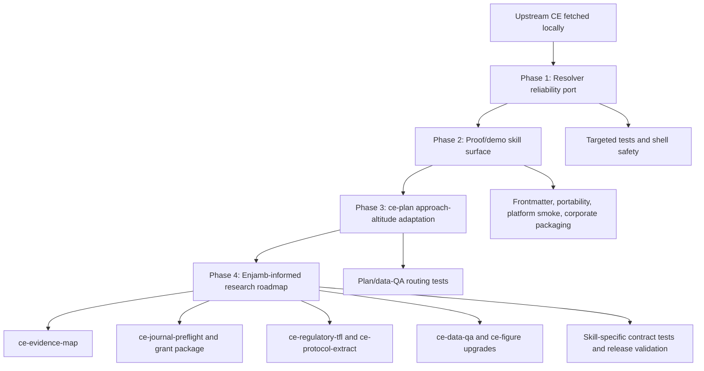

# feat: Port upstream CE hardening and Enjamb-informed research workflows

## Summary

Port the latest upstream CE reliability fixes, resolve current missing-skill references, and turn the Enjamb-informed research lifecycle gaps into a phased `ce-datascience` roadmap. The work should start with reliability and install correctness before adding new scientific workflow skills.

---

## Problem Frame

`ce-datascience` is intentionally not a wholesale mirror of upstream Compound Engineering. The latest upstream CE code was fetched to `upstream/main`, but direct merge is unsafe because upstream owns `plugins/compound-engineering` while this fork curates `plugins/ce-datascience`. The current plugin also references `ce-proof` and `ce-demo-reel` from several user-facing handoff paths without shipping those skills, which can break real slash-command workflows. Enjamb research highlights a broader product gap: `ce-datascience` has strong individual lifecycle skills, but weaker source-traceable, collaborative, submission-ready connections between literature, methods, data, figures, grants, regulatory artifacts, and manuscripts.

---

## Requirements

**Reliability and upstream porting**

- R1. PR feedback resolution must fail loudly when owner/repo detection fails and must never silently continue with an empty repository context.
- R2. PR feedback replies and resolves must verify the authoritative GitHub review-thread ID before mutation so GitHub Enterprise node-ID mismatches cannot route replies to the wrong thread.
- R3. Upstream CE fixes must be ported surgically into `ce-datascience` adaptations without replacing SAP, reporting, reproducibility, or health data science behavior.

**Missing skill surface**

- R4. Every user-facing `ce-proof` and `ce-demo-reel` handoff in shipped skills must either resolve to an installed skill or be gated with a clear fallback.
- R5. Any ported Proof/demo workflow must be optional at runtime and safe for corporate/offline installs.
- R6. New skill inventory must remain portable across Claude, Codex, OpenCode, Pi, Gemini, and Kiro conversion paths.

**Roadmap features**

- R7. The roadmap must prioritize source-traceable research workflows before speculative or cloud-workspace-like features.
- R8. New scientific workflow skills must preserve the data-QA-before-SAP/modeling rule and avoid autonomous inferential analysis without human checkpoints.
- R9. New Enjamb-inspired features must avoid unsupported promises such as full regulatory programming, guaranteed biological diagram accuracy, or cloud collaboration parity.

---

## Key Technical Decisions

- **Selective port, not merge:** Use `upstream/main` as a reference source and copy/adapt only specific upstream skill files, scripts, and prose. Direct merge would delete or overwrite data-science plugin files.
- **Reliability first:** Implement resolver hardening before feature additions because it prevents PR workflow damage and is narrow enough to test independently.
- **Port missing Proof/demo skills as optional skills:** Prefer shipping the missing skills over merely removing menu options, because existing `ce-plan`, `ce-brainstorm`, `ce-ideate`, and `ce-commit-push-pr` flows already assume those destinations exist.
- **Keep skill ports self-contained:** `ce-proof` and `ce-demo-reel` support files must live under their own skill directories; no cross-skill references or installed-cache paths.
- **Roadmap as phased plugin work:** Add Enjamb-inspired features as small, testable skills or extensions. Do not introduce a hosted workspace dependency or a new platform target.
- **No release-owned version changes:** Update manifests/counts through normal metadata sync and validation only; do not hand-bump versions or write release notes.

---

## High-Level Technical Design

---

## Scope Boundaries

### In Scope

- Port upstream `ce-resolve-pr-feedback` owner/repo failure handling and thread-ID verification into the adapted data-science resolver.
- Port or gate `ce-proof` and `ce-demo-reel` so all existing handoff paths are real.
- Adapt upstream `ce-plan` approach-altitude behavior into the dual-mode data science planner while preserving SAP mode and data QA requirements.
- Add implementation-ready roadmap units for source-traceable evidence maps, journal/grant/regulatory workflows, protocol extraction, diagram/export support, and multi-file data profiling.
- Update docs, plugin inventory, release metadata tests, and converter/package coverage alongside any shipped skill.

### Deferred to Follow-Up Work

- Full hosted collaborative workspace parity with Enjamb.
- Full SDTM/ADaM generation or validated regulatory programming.
- Automated procurement order generation.
- Autonomous end-to-end statistical analysis without sprint, SAP, data lock, and human review gates.

### Outside This Product's Identity

- Wholesale upstream CE mirroring.
- Rails, DHH, frontend polish, Xcode, and generic software-product workflows unless a later data-science-specific need justifies them.
- New platform targets outside the currently supported conversion matrix.

---

## Implementation Units

### U1. Port PR feedback resolver hardening

- **Goal:** Make PR feedback resolution fail explicitly on missing repo context and verify authoritative thread IDs before replying or resolving.
- **Requirements:** R1, R2, R3.
- **Dependencies:** None.
- **Files:**
  - `plugins/ce-datascience/skills/ce-resolve-pr-feedback/scripts/get-pr-comments`
  - `plugins/ce-datascience/skills/ce-resolve-pr-feedback/scripts/get-thread-for-comment`
  - `plugins/ce-datascience/skills/ce-resolve-pr-feedback/references/full-mode.md`
  - `plugins/ce-datascience/skills/ce-resolve-pr-feedback/references/targeted-mode.md`
  - `tests/resolve-pr-feedback.test.ts`
- **Approach:** Port the upstream `|| true` detection guard and actionable stderr text while preserving the existing `cross_invocation` envelope and data-science concern categories. Add a review-thread verification step before the reply/resolve flow that re-resolves the target thread from the comment URL's numeric ID and uses the returned thread ID when it differs.
- **Patterns to follow:** Upstream commits `bb0c9ab4` and `6f9ab03a`; local resolver split references under `plugins/ce-datascience/skills/ce-resolve-pr-feedback/references/`.
- **Test scenarios:**
  - Running `get-pr-comments` outside a git repo with no `OWNER/REPO` argument exits nonzero and prints the full "pass OWNER/REPO" instruction.
  - Running `get-thread-for-comment` outside a git repo with no `OWNER/REPO` argument exits nonzero and prints the full third-argument instruction.
  - Passing an explicit `OWNER/REPO` bypasses auto-detection and routes that owner/repo into the GraphQL call.
  - Full-mode reference contains a pre-reply thread verification step and tells the resolver to use the authoritative returned thread ID.
  - The existing `cross_invocation` output shape remains documented and test-covered.
- **Verification:** A targeted resolver test file proves shell behavior and reference text; `bun test tests/resolve-pr-feedback.test.ts tests/skill-shell-safety.test.ts` passes.

### U2. Port `ce-proof` as an optional collaborative review skill

- **Goal:** Make existing Proof handoffs real for plans, brainstorm artifacts, ideation artifacts, and manuscript-adjacent review docs.
- **Requirements:** R4, R5, R6.
- **Dependencies:** U1 is not required, but land after U1 to keep reliability first.
- **Files:**
  - `plugins/ce-datascience/skills/ce-proof/SKILL.md`
  - `plugins/ce-datascience/skills/ce-proof/references/hitl-review.md`
  - `plugins/ce-datascience/skills/ce-plan/references/plan-handoff.md`
  - `plugins/ce-datascience/skills/ce-brainstorm/references/handoff.md`
  - `plugins/ce-datascience/skills/ce-ideate/references/post-ideation-workflow.md`
  - `plugins/ce-datascience/README.md`
  - `README.md`
  - `tests/frontmatter.test.ts`
  - `tests/plugin-content-portability.test.ts`
  - `tests/platform-smoke.test.ts`
- **Approach:** Copy the upstream skill and adapt identity, language, and fallback text to `ce-datascience`. Keep Proof as an optional external service: persistent failure returns the user to local file workflows rather than blocking the plan or brainstorm. Update callers only where needed to avoid dangling menu options or to clarify fallback behavior.
- **Patterns to follow:** Existing handoff references in `ce-plan`, `ce-brainstorm`, and `ce-ideate`; self-contained skill rule in `AGENTS.md`.
- **Test scenarios:**
  - Frontmatter validation includes `ce-proof` with supported tools and no missing referenced files.
  - Portability validation rejects no absolute source-checkout or installed-cache paths in `ce-proof`.
  - Generated Codex, Claude alias, and one non-Codex install include `ce-proof` support files.
  - Proof failure language routes users back to local saved artifacts instead of claiming upload success.
- **Verification:** Targeted frontmatter, portability, and platform smoke tests pass, then `bun run release:validate` reports the new skill count consistently.

### U3. Port `ce-demo-reel` without breaking flat-install safety

- **Goal:** Make PR evidence capture available when `ce-commit-push-pr` asks for a demo while preserving user-owned flat `ce-demo-reel` directories.
- **Requirements:** R4, R5, R6.
- **Dependencies:** U2 for shared optional external-service language; U1 for reliability-first sequencing.
- **Files:**
  - `plugins/ce-datascience/skills/ce-demo-reel/SKILL.md`
  - `plugins/ce-datascience/skills/ce-demo-reel/references/tier-browser-reel.md`
  - `plugins/ce-datascience/skills/ce-demo-reel/references/tier-screenshot-reel.md`
  - `plugins/ce-datascience/skills/ce-demo-reel/references/tier-static-screenshots.md`
  - `plugins/ce-datascience/skills/ce-demo-reel/references/tier-terminal-recording.md`
  - `plugins/ce-datascience/skills/ce-demo-reel/references/upload-and-approval.md`
  - `plugins/ce-datascience/skills/ce-demo-reel/scripts/capture-demo.py`
  - `plugins/ce-datascience/skills/ce-commit-push-pr/SKILL.md`
  - `scripts/package/corporate-artifacts.sh`
  - `tests/codex-writer.test.ts`
  - `tests/corporate-install.test.ts`
  - `tests/platform-smoke.test.ts`
  - `tests/plugin-content-portability.test.ts`
- **Approach:** Port upstream evidence capture as an optional skill with local-save fallback and strong secret-screening language. Keep existing stale-cleanup behavior that preserves user-authored flat `~/.codex/skills/ce-demo-reel` directories; current CE plugin packaging should install under managed plugin paths, not sweep user-owned flat skills.
- **Patterns to follow:** Existing `ce-commit-push-pr` evidence decision flow and the `codex-writer` preservation test for flat user skills.
- **Test scenarios:**
  - `ce-commit-push-pr` references an installed `ce-demo-reel` skill, not a missing dependency.
  - Corporate ZIP artifacts include the demo skill and exclude `__pycache__`, `.pyc`, generated temp output, and dev caches.
  - Codex install preserves a user-owned flat `ce-demo-reel` directory while still installing the managed plugin skill.
  - Portability tests confirm helper scripts are invoked through `python3` or executable mode as appropriate.
- **Verification:** Corporate install, platform smoke, Codex writer, frontmatter, and portability tests pass.

### U4. Adapt upstream `ce-plan` approach-altitude behavior

- **Goal:** Add upstream "plan the approach" and answer-seeking routing to the data-science planner without weakening SAP mode.
- **Requirements:** R3, R8.
- **Dependencies:** U1 can land independently; U2/U3 not required.
- **Files:**
  - `plugins/ce-datascience/skills/ce-plan/SKILL.md`
  - `plugins/ce-datascience/skills/ce-plan/references/approach-altitude.md`
  - `plugins/ce-datascience/skills/ce-plan/references/universal-planning.md`
  - `plugins/ce-datascience/skills/ce-plan/references/sap-mode-workflow.md`
  - `tests/data-qa-first-planning.test.ts`
  - `tests/plugin-content-portability.test.ts`
  - `tests/frontmatter.test.ts`
- **Approach:** Insert upstream approach-altitude recognition before domain split, but after resume/deepen handling. Keep SAP detection and the data-shape-before-SAP rule load-bearing: study-shaped requests still route to SAP mode unless the user explicitly asks for an approach plan rather than the SAP deliverable.
- **Patterns to follow:** Upstream `ce-plan/references/approach-altitude.md`; current `ce-datascience` dual-mode and data QA rules.
- **Test scenarios:**
  - "Plan how you would approach evaluating X" produces an approach plan path rather than a normal implementation/SAP plan.
  - Study-shaped input with population/exposure/outcome still routes to SAP mode when it asks for a SAP.
  - Study-shaped input with explicit "plan the approach first" does not write variable/model sections before data QA.
  - `approach-altitude.md` is copied inside the `ce-plan` skill directory and no external skill reference is introduced.
- **Verification:** `bun test tests/data-qa-first-planning.test.ts tests/plugin-content-portability.test.ts tests/frontmatter.test.ts` passes.

### U5. Add `ce-evidence-map` for source-traceable literature synthesis

- **Goal:** Add a structured evidence-map skill that connects research questions, PubMed searches, full-text availability, methods extraction, effect-size extraction, and claim-to-source traceability.
- **Requirements:** R7, R8, R9.
- **Dependencies:** U4 clarifies when planning should ask for an evidence-map approach first.
- **Files:**
  - `plugins/ce-datascience/skills/ce-evidence-map/SKILL.md`
  - `plugins/ce-datascience/skills/ce-evidence-map/references/evidence-map-schema.yaml`
  - `plugins/ce-datascience/skills/ce-evidence-map/references/evidence-map-template.md`
  - `plugins/ce-datascience/skills/ce-evidence-map/scripts/build_evidence_map.py`
  - `plugins/ce-datascience/skills/ce-pubmed/SKILL.md`
  - `plugins/ce-datascience/skills/ce-method-extract/SKILL.md`
  - `plugins/ce-datascience/skills/ce-effect-size/SKILL.md`
  - `plugins/ce-datascience/README.md`
  - `tests/evidence-map.test.ts`
  - `tests/frontmatter.test.ts`
  - `tests/plugin-content-portability.test.ts`
- **Approach:** Produce a local, auditable artifact rather than a broad literature-review essay. The map records query strings, included/excluded citations, full-text status, extracted method fields, claim/source links, and downstream handoff signals for SAP and power planning.
- **Patterns to follow:** `ce-pubmed` structured CSV output, `ce-method-extract` methods table flow, and `ce-effect-size` effect-size anchoring.
- **Test scenarios:**
  - A fixture PubMed CSV plus method-extract fixture produces an evidence-map markdown and YAML/JSON index with stable IDs.
  - Abstract-only papers are labeled separately from full-text-verified sources.
  - A claim without a source is flagged rather than silently emitted.
  - The skill emits a handoff hint that `ce-plan` can consume without pretending the evidence map finalized analysis decisions.
- **Verification:** Evidence-map unit tests, frontmatter, portability, and release validation pass.

### U6. Add journal and grant package workflows

- **Goal:** Cover Enjamb-like submission support without claiming hosted editor or 700-template parity.
- **Requirements:** R7, R9.
- **Dependencies:** U5 improves source/citation readiness but is not a hard dependency for journal preflight.
- **Files:**
  - `plugins/ce-datascience/skills/ce-journal-preflight/SKILL.md`
  - `plugins/ce-datascience/skills/ce-journal-preflight/references/preflight-template.md`
  - `plugins/ce-datascience/skills/ce-journal-preflight/scripts/check_journal_package.py`
  - `plugins/ce-datascience/skills/ce-grant-match/SKILL.md`
  - `plugins/ce-datascience/skills/ce-grant-match/references/grant-fit-template.md`
  - `plugins/ce-datascience/skills/ce-manuscript-package/SKILL.md`
  - `plugins/ce-datascience/shared/journal-style-profiles.yaml`
  - `plugins/ce-datascience/README.md`
  - `tests/journal-preflight.test.ts`
  - `tests/grant-match.test.ts`
  - `tests/manuscript-package.test.ts`
- **Approach:** Implement journal preflight as validation against target instructions, reporting checklist state, figure/table artifacts, and manuscript package manifests. Implement grant matching as a conservative fit/risk worksheet that can use Grants.gov or user-provided opportunities but does not submit applications or invent funding history.
- **Patterns to follow:** `ce-manuscript-package`, `ce-review-pack`, and shared journal style profile conventions.
- **Test scenarios:**
  - Journal preflight detects missing figure exports, missing checklist attachment, missing bibliography, and out-of-policy format declarations.
  - Grant matching with a fixture opportunity list produces ranked fit/risk rows and required-document placeholders.
  - Missing opportunity data produces an explicit "needs user/source input" result, not a fabricated match.
- **Verification:** New skill tests and existing manuscript package tests pass.

### U7. Add regulatory/TFL assessment and protocol extraction

- **Goal:** Add scoped assessment workflows for regulated clinical studies and protocol/SOP synthesis without overpromising full regulatory programming.
- **Requirements:** R7, R8, R9.
- **Dependencies:** U5 for source traceability when protocol extraction uses literature; U6 for package handoff.
- **Files:**
  - `plugins/ce-datascience/skills/ce-regulatory-tfl/SKILL.md`
  - `plugins/ce-datascience/skills/ce-regulatory-tfl/references/tfl-assessment-template.md`
  - `plugins/ce-datascience/skills/ce-protocol-extract/SKILL.md`
  - `plugins/ce-datascience/skills/ce-protocol-extract/references/protocol-table-template.md`
  - `plugins/ce-datascience/skills/ce-protocol-extract/scripts/extract_protocol.py`
  - `plugins/ce-datascience/skills/ce-sap-tabular/SKILL.md`
  - `plugins/ce-datascience/skills/ce-prereg/SKILL.md`
  - `tests/regulatory-tfl.test.ts`
  - `tests/protocol-extract.test.ts`
  - `tests/prereg-registry-package.test.ts`
- **Approach:** `ce-regulatory-tfl` inventories whether a project is regulatory-facing, what TFL shells and QC plans are expected, and what is missing. `ce-protocol-extract` extracts steps, parameters, materials/equipment, and uncertainty flags from papers, supplements, SOPs, or user-provided methods text.
- **Patterns to follow:** `ce-sap-tabular` output-catalog discipline and `ce-prereg` registry package validation.
- **Test scenarios:**
  - Regulatory/TFL assessment identifies manuscript-only vs regulatory-facing scope from fixture metadata and refuses full SDTM/ADaM generation claims.
  - Protocol extraction emits missing-detail flags when a method omits timing, concentration, or equipment fields.
  - Extracted protocol rows can be referenced from preregistration or SAP artifacts without forcing analysis execution.
- **Verification:** New skill tests plus preregistration package tests pass.

### U8. Strengthen figure export and multi-file data discovery

- **Goal:** Close two Enjamb-inspired gaps: scientific diagram/export workflows and pattern discovery across many raw datasets.
- **Requirements:** R7, R8, R9.
- **Dependencies:** U5 for source traceability where diagrams or discovery claims cite evidence.
- **Files:**
  - `plugins/ce-datascience/skills/ce-figure/SKILL.md`
  - `plugins/ce-datascience/skills/ce-figure/references/figure-spec.md`
  - `plugins/ce-datascience/skills/ce-figure/references/scientific-diagram-review.md`
  - `plugins/ce-datascience/skills/ce-figure/scripts/validate_figure_manifest.py`
  - `plugins/ce-datascience/skills/ce-data-qa/SKILL.md`
  - `plugins/ce-datascience/skills/ce-data-qa/references/multi-file-discovery.md`
  - `plugins/ce-datascience/skills/ce-data-qa/scripts/profile_many_files.py`
  - `tests/figure-workflow.test.ts`
  - `tests/data-qa-first-planning.test.ts`
  - `tests/multi-file-data-discovery.test.ts`
- **Approach:** Extend `ce-figure` with diagram intent, provenance, human review status, export requirements, and alt text/caption support. Extend `ce-data-qa` with a pre-SAP multi-file discovery mode that reports schema, grain, key/date candidates, missingness, duplicates, and obvious validity issues while clearly warning that it is not inferential modeling.
- **Patterns to follow:** Existing JAMA figure validation rules, the data-QA-first planning rule, and current `ce-data-qa` GO/NO-GO language.
- **Test scenarios:**
  - Figure validation flags missing source data, missing export formats, missing review status for generated diagrams, and too-small text.
  - Multi-file discovery detects shared keys, incompatible grains, high-missingness columns, duplicate candidate keys, and date validity issues from fixture CSVs.
  - Multi-file discovery emits a pre-SAP handoff and refuses to label associations as findings.
- **Verification:** Figure, data-QA, and new multi-file discovery tests pass.

---

## Acceptance Examples

- AE1. Given `get-pr-comments` runs outside a git repo with no explicit `OWNER/REPO`, when `gh repo view` fails, then the script exits nonzero with an actionable owner/repo instruction instead of returning no output.
- AE2. Given a GitHub Enterprise review comment whose thread ID differs between query paths, when `ce-resolve-pr-feedback` replies, then it re-resolves the parent thread from the comment node and uses the authoritative thread ID.
- AE3. Given a converted Codex install, when a user invokes a `ce-plan` handoff to Proof, then the managed plugin contains `ce-proof` support files or the menu explains the local fallback.
- AE4. Given a user-owned flat `~/.codex/skills/ce-demo-reel` directory, when the managed plugin installs, then that user-owned skill remains untouched.
- AE5. Given a research question and PubMed/method fixtures, when `ce-evidence-map` runs, then every emitted claim has a source status or is flagged as unsourced.
- AE6. Given multiple raw CSV extracts, when `ce-data-qa` runs multi-file discovery, then it reports columns, grain, key/date candidates, and validity issues without making inferential claims.

---

## System-Wide Impact

This plan affects the plugin inventory, platform conversion outputs, corporate/offline packaging, slash-skill discoverability, and public README claims. Every new skill changes release metadata counts and increases the burden on frontmatter, portability, and platform smoke tests. The resolver work affects PR mutation safety and should land independently before broader feature work.

---

## Risks & Dependencies

- **Dirty working tree risk:** Existing uncommitted setup/MCP work should be committed, isolated, or carefully excluded before implementing this plan.
- **External service risk:** Proof and demo upload flows depend on external services or local tools. Each must have local/offline fallback language and tests.
- **Scope creep risk:** Enjamb's public positioning is broad. This plugin should implement local, auditable workflows rather than trying to clone a hosted research workspace.
- **Regulatory overpromise risk:** Regulatory/TFL features should assess readiness and gaps first; full SDTM/ADaM generation needs separate domain review.
- **Inventory drift risk:** Adding skills without release metadata validation will break marketplace counts and support tables.

---

## Documentation / Operational Notes

- Update `README.md`, `docs/setup.md`, and `plugins/ce-datascience/README.md` whenever skill inventory or install behavior changes.
- Update `docs/solutions/workflow/upstream-ce-feature-curation.md` if the deferred-upstream policy changes because Proof/demo become included.
- Keep corporate install docs explicit that Proof, upload hosting, browser capture tools, Quarto, Bun, GitHub CLI, and package managers are optional unless a selected workflow needs them.
- Do not hand-author release notes or bump release-owned versions.

---

## Sources & Research

- `docs/ideation/2026-06-06-upstream-ce-enjamb-feature-ports.md` records the upstream fetch, Enjamb source review, and ranked candidate list.
- `docs/solutions/workflow/upstream-ce-feature-curation.md` defines the existing selective-port policy for this fork.
- `plugins/ce-datascience/skills/ce-resolve-pr-feedback/` contains the adapted resolver surface that must preserve cross-invocation clustering.
- `plugins/ce-datascience/skills/ce-plan/SKILL.md` contains the dual SAP/implementation planner and the data-shape-before-SAP rule.
- `tests/codex-writer.test.ts` already protects user-owned flat `ce-demo-reel` directories from stale cleanup.
- Public Enjamb sources reviewed in the ideation artifact: homepage, IRE vision post, pre-seed post, YC profile, and privacy policy.
