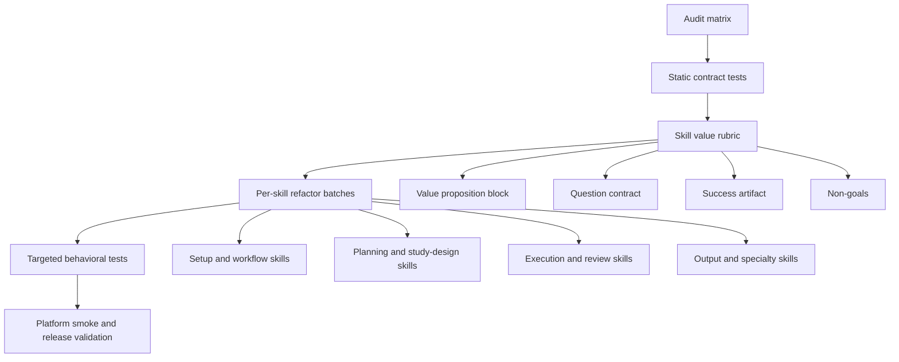

# fix: Hone ce-datascience skill value propositions

## Overview

This plan refactors all 48 `ce-datascience` skills so each skill has a clear value proposition, asks only load-bearing questions, and behaves consistently across Claude Code, Codex, and converted target platforms. The work is not a broad rewrite of scientific content. It is a reliability and usability pass that makes each skill answer: what problem it solves, when to use it, what it produces, what it refuses to do, and what evidence or artifact proves success.

---

## Problem Frame

The package now passes structural validation, but real users can still hit workflow friction: long skill prompts bury key behavior, frontmatter descriptions read like mini-specs, platform question-tool boilerplate is duplicated, and some workflows ask survey-style questions before using available repo, data, or chat signals. The audit in `docs/plans/2026-06-06-skill-qa-enhancement-audit.md` found no missing references, but it identified workflow quality as the next reliability risk.

The desired end state is a skill catalog that feels intentional: every slash skill should have a tight trigger, a visible deliverable, a small set of high-value questions, and a direct handoff into the next workflow.

---

## Requirements Trace

### Skill Value

- R1. Every skill must expose a concise value proposition: user problem, trigger, durable output, and explicit non-goal.
- R2. Every frontmatter description must be discoverable and short enough to route the skill without becoming a full instruction body.
- R3. Every skill that asks questions must ask only decision-changing questions after first using repo, config, data, and chat-context signals.
- R4. Every skill must state its success artifact or completion signal, such as a file, report, workbook, issue draft, profile, or review verdict.

### Platform Reliability

- R5. Skill Q/A instructions must work in Claude Code and Codex without duplicating long platform-specific paragraphs in every skill.
- R6. Runtime skill references must remain self-contained inside each skill directory; no skill may depend on a sibling skill file or a global shared runtime reference.
- R7. Claude-only behavior must either be platform-filtered or include a clear Codex/offline fallback.
- R8. Helper/script guidance must prefer `python3`, `Rscript`, `bash`, executable mode, or clearly optional install steps.

### Maintainability

- R9. Long skills must move rare branches, examples, fallback procedures, and mode-specific detail into co-located `references/`.
- R10. The test suite must catch duplicated Q/A boilerplate, missing local references, frontmatter drift, long-description regressions, and unsafe platform promises.
- R11. The README and setup docs must match the resulting skill experience, especially namespaced Claude plugin invocation and Codex/local alias behavior.

---

## Scope Boundaries

- Do not add or remove public skills in this pass.
- Do not change release-owned versions or write release notes.
- Do not add new platform targets.
- Do not weaken scientific rigor, SAP structure, reporting-checklist obligations, PHI protections, CLIF rules, or auditability.
- Do not create one shared runtime reference that skills import across directories; that violates the repo's self-contained skill rule.

### Deferred to Follow-Up Work

- Full behavioral rewrites of individual scientific methods skills: defer unless needed to satisfy this plan's value and Q/A contract.
- New feature workflows beyond the existing audit backlog, such as additional registry formats or new manuscript outputs.
- Evals that simulate full Claude/Codex conversations for every skill. This plan adds static and targeted behavioral tests first.

---

## Context & Research

### Relevant Code and Patterns

- `plugins/ce-datascience/skills/*/SKILL.md` - 48 skill entrypoints to audit and refactor.
- `plugins/ce-datascience/skills/*/references/` - preferred location for progressive-disclosure material.
- `tests/frontmatter.test.ts` - validates skill and agent frontmatter.
- `tests/plugin-content-portability.test.ts` - validates self-contained references, platform filters, path safety, and package artifact hygiene.
- `tests/data-qa-first-planning.test.ts` - example of workflow behavior tests around planning and QA gates.
- `plugins/ce-datascience/README.md` and `docs/setup.md` - user-facing setup and slash-command guidance.

### Audit Inputs

- `docs/plans/2026-06-06-skill-qa-enhancement-audit.md` - current skill-by-skill enhancement matrix.

### External References

- Claude Code plugin docs: plugin skills are namespaced and live under `skills/<name>/SKILL.md`.
- Claude Code skills docs: skills can include supporting files and can be directly invoked.
- Codex plugin/skills docs: skills are repeatable process playbooks; plugin/app access must not imply extra data permissions.

---

## Key Technical Decisions

- **Value contract per skill:** Add or standardize a compact section in every skill with "Use when", "Output", "Ask only if", and "Do not do". This gives users and agents a stable understanding without reading the entire skill.
- **Local interaction contract, not global runtime import:** Because skills are self-contained, interactive skills should either embed a short standard Q/A block or carry a local `references/interaction-contract.md`. A repo-level source can exist for maintainers, but runtime skill content must stay local.
- **Progressive disclosure for long skills:** Keep the entrypoint short and move mode-specific procedures into references. The entrypoint should route and preserve invariants; references should carry rare branches.
- **Evidence-first questioning:** Skills should scan available context before asking. `ce-setup`, `ce-workflow`, `ce-plan`, `ce-brainstorm`, `ce-data-qa`, and `ce-sap-tabular` should use existing config, handoff markers, file signals, and artifacts to narrow questions.
- **Tests before bulk edits:** Add static tests for the new contract before refactoring all skills so regressions are visible during the pass.

---

## Open Questions

### Resolved During Planning

- Should all skills link to one shared interaction contract? No. Runtime links across skill directories violate the self-contained-skill rule. Use local copies or compact embedded wording.
- Should this pass rewrite scientific methodology? No. The work focuses on value framing, Q/A relevance, progressive disclosure, and platform accuracy.
- Should `ce-setup` keep detailed survey mode? Yes, but it should become opt-in or signal-triggered rather than the default path when enough evidence exists.

### Deferred to Implementation

- Exact line budget for `SKILL.md`: choose after measuring current distribution and deciding which long skills need temporary allowlisting.
- Exact description character budget: choose a limit that improves discovery without breaking existing frontmatter tests or skill routing.

---

## High-Level Technical Design

> This illustrates the intended approach and is directional guidance for review, not implementation specification. The implementing agent should treat it as context, not code to reproduce.

---

## Implementation Units

- U1. **Add the skill value rubric and static tests**

**Goal:** Create the testable contract that every skill must satisfy before bulk editing begins.

**Requirements:** R1, R2, R4, R10

**Dependencies:** None

**Files:**
- Create: `tests/skill-value-contract.test.ts`
- Modify: `tests/plugin-content-portability.test.ts`
- Modify: `docs/plans/2026-06-06-skill-qa-enhancement-audit.md`

**Approach:**
- Define required entrypoint signals: value proposition, output artifact, non-goal/refusal boundary, and Q/A contract if interactive.
- Add tests that report missing sections, overlong descriptions, missing success artifacts, and duplicated long platform question-tool boilerplate.
- Start with warnings or allowlists for known long skills if a hard fail would make the first implementation PR too large.

**Patterns to follow:**
- Existing frontmatter and portability tests use filesystem scans over plugin content.
- Existing tests avoid requiring exact prose except where a contract is load-bearing.

**Test scenarios:**
- Happy path: a compliant skill with value, output, and non-goal language passes.
- Error path: a skill with duplicated `AskUserQuestion`/`ToolSearch` boilerplate outside an allowed contract fails or is reported.
- Error path: a skill with a long description but no allowlist entry fails.
- Integration: all current 48 skills are enumerated so newly added skills enter the contract automatically.

**Verification:**
- `bun test tests/skill-value-contract.test.ts tests/plugin-content-portability.test.ts`

---

- U2. **Create portable interaction contract patterns**

**Goal:** Replace random or duplicated Q/A mechanics with a short, consistent contract that still works in Claude Code, Codex, Gemini, and Pi conversions.

**Requirements:** R3, R5, R6, R10

**Dependencies:** U1

**Files:**
- Create: `docs/solutions/skill-design/portable-interaction-contract.md`
- Modify: `plugins/ce-datascience/skills/ce-setup/SKILL.md`
- Modify: `plugins/ce-datascience/skills/ce-workflow/SKILL.md`
- Modify: `plugins/ce-datascience/skills/ce-brainstorm/SKILL.md`
- Modify: `plugins/ce-datascience/skills/ce-plan/SKILL.md`
- Modify: `plugins/ce-datascience/skills/ce-code-review/SKILL.md`
- Modify: `plugins/ce-datascience/skills/ce-compound/SKILL.md`
- Modify: `plugins/ce-datascience/skills/ce-compound-refresh/SKILL.md`
- Modify: `plugins/ce-datascience/skills/ce-ideate/SKILL.md`
- Modify: `plugins/ce-datascience/skills/ce-debug/SKILL.md`
- Modify: `plugins/ce-datascience/skills/ce-report-bug/SKILL.md`

**Approach:**
- Document the maintainer-facing interaction pattern under `docs/solutions/skill-design/`.
- In each skill, replace duplicated paragraphs with concise local wording:
  - inspect evidence first
  - ask one question at a time
  - use the platform blocking question tool when available
  - fall back to numbered options only when the tool is unavailable
  - never skip a user-facing decision
- Keep runtime text self-contained. Do not make skills reference `docs/solutions/` at runtime.

**Patterns to follow:**
- `AGENTS.md` already maps Claude question tools to Codex behavior for this repo.
- Existing portability tests enforce self-contained skill directories.

**Test scenarios:**
- Happy path: interactive skills contain the compact local interaction wording.
- Error path: old duplicated platform boilerplate is flagged outside allowlisted compatibility skills.
- Integration: no skill references `docs/solutions/skill-design/portable-interaction-contract.md` from `SKILL.md`.

**Verification:**
- `bun test tests/skill-value-contract.test.ts tests/plugin-content-portability.test.ts`

---

- U3. **Refactor setup and navigator skills for evidence-first value**

**Goal:** Make first-run setup and workflow navigation useful quickly rather than feeling like a random survey.

**Requirements:** R1, R3, R4, R5, R7, R11

**Dependencies:** U1, U2

**Files:**
- Modify: `plugins/ce-datascience/skills/ce-setup/SKILL.md`
- Modify: `plugins/ce-datascience/skills/ce-setup/references/config-template.yaml`
- Modify: `plugins/ce-datascience/skills/ce-setup/references/stack-profile-template.yaml`
- Modify: `plugins/ce-datascience/skills/ce-workflow/SKILL.md`
- Modify: `plugins/ce-datascience/skills/ce-mcp-server/SKILL.md`
- Modify: `plugins/ce-datascience/skills/ce-update/SKILL.md`
- Modify: `docs/setup.md`
- Modify: `plugins/ce-datascience/README.md`
- Test: `tests/setup-workflow.test.ts`
- Test: `tests/plugin-content-portability.test.ts`

**Approach:**
- Add a minimum viable setup path that uses existing config, IDE signals, notebooks, lockfiles, verified connection handoffs, and project files before asking questions.
- Keep detailed survey as `--detailed` or an explicit branch when signals are insufficient.
- Make `ce-workflow` the post-setup "what should I run next?" surface.
- Keep `ce-update` Claude-only, but document Codex/offline refresh outside that skill so Codex users are not stranded.
- Separate missing optional tools from blockers. Quarto, GitHub CLI, Bun, and package managers should not block basic setup unless the chosen workflow needs them.

**Patterns to follow:**
- Current `ce-setup` language refinement logic: Marimo/Jupyter -> Python, RStudio -> R, VS Code/Quarto -> both.
- Current `__CE_CONNECTION__` handoff contract.

**Test scenarios:**
- Happy path: Python notebook repo with Marimo/Jupyter signals completes setup with no R package questions.
- Happy path: verified database handoff defaults data layer to database and keeps `data_root` optional.
- Edge case: no signals triggers concise questions and offers detailed survey.
- Error path: corporate mode reports missing optional tools without install commands.
- Integration: `ce-workflow` output recommends the next skill after setup.

**Verification:**
- `bun test tests/setup-workflow.test.ts tests/plugin-content-portability.test.ts`
- `bun run release:validate`

---

- U4. **Refactor planning and study-design skills around deliverables**

**Goal:** Make the research planning path explain exactly what each skill contributes and which artifact downstream skills consume.

**Requirements:** R1, R2, R3, R4, R9

**Dependencies:** U1, U2

**Files:**
- Modify: `plugins/ce-datascience/skills/ce-brainstorm/SKILL.md`
- Modify: `plugins/ce-datascience/skills/ce-plan/SKILL.md`
- Modify: `plugins/ce-datascience/skills/ce-research-question/SKILL.md`
- Modify: `plugins/ce-datascience/skills/ce-checklist-match/SKILL.md`
- Modify: `plugins/ce-datascience/skills/ce-cohort-build/SKILL.md`
- Modify: `plugins/ce-datascience/skills/ce-data-qa/SKILL.md`
- Modify: `plugins/ce-datascience/skills/ce-sap-tabular/SKILL.md`
- Modify: `plugins/ce-datascience/skills/ce-effect-size/SKILL.md`
- Modify: `plugins/ce-datascience/skills/ce-power/SKILL.md`
- Modify: `plugins/ce-datascience/skills/ce-prereg/SKILL.md`
- Test: `tests/data-qa-first-planning.test.ts`
- Test: `tests/sap-tabular-workbook.test.ts`
- Test: `tests/skill-value-contract.test.ts`

**Approach:**
- Add a consistent value block to each study-design skill.
- Ensure each skill names its durable handoff marker or artifact:
  - `ce-research-question`: `analysis/research-question.yaml`
  - `ce-data-qa`: `__CE_DATA_PROFILE__` or GO/NO-GO report
  - `ce-plan`: SAP or implementation plan
  - `ce-sap-tabular`: workbook CSVs and `.xlsx`
  - `ce-checklist-match`: canonical reporting checklist fields
- Move long trigger catalogs and rare branches into references where appropriate.
- Reduce `ce-plan` entrypoint bloat by keeping SAP and deepening detail in references.

**Patterns to follow:**
- Current SAP workbook contract from `ce-sap-tabular`.
- Current data-QA-first planning tests.

**Test scenarios:**
- Happy path: every study-design skill includes an output artifact or handoff marker.
- Happy path: `ce-plan` still requires data QA and tabular SAP for new SAPs.
- Edge case: exploratory request routes to `ce-brainstorm` recommendation without abandoning planning if directly invoked.
- Integration: `ce-workflow` lifecycle sequence still includes research question -> literature -> checklist -> cohort -> data QA -> SAP -> tabular SAP.

**Verification:**
- `bun test tests/data-qa-first-planning.test.ts tests/sap-tabular-workbook.test.ts tests/skill-value-contract.test.ts`

---

- U5. **Refactor execution, review, and engineering skills for action clarity**

**Goal:** Make implementation and review skills clear about when they mutate files, when they are read-only, and what completion looks like.

**Requirements:** R1, R3, R4, R5, R8, R9

**Dependencies:** U1, U2

**Files:**
- Modify: `plugins/ce-datascience/skills/ce-work/SKILL.md`
- Modify: `plugins/ce-datascience/skills/ce-code-review/SKILL.md`
- Modify: `plugins/ce-datascience/skills/ce-debug/SKILL.md`
- Modify: `plugins/ce-datascience/skills/ce-commit/SKILL.md`
- Modify: `plugins/ce-datascience/skills/ce-commit-push-pr/SKILL.md`
- Modify: `plugins/ce-datascience/skills/ce-resolve-pr-feedback/SKILL.md`
- Modify: `plugins/ce-datascience/skills/ce-clean-gone-branches/SKILL.md`
- Modify: `plugins/ce-datascience/skills/ce-worktree/SKILL.md`
- Test: `tests/skill-value-contract.test.ts`
- Test: `tests/plugin-content-portability.test.ts`

**Approach:**
- Split `ce-code-review` mode details into references and keep the entrypoint focused on scope, mode, reviewers, routing, and output.
- Clarify `ce-work` modes: SAP execution, generic implementation, and subagent/worktree behavior.
- Make mutation boundaries visible in all engineering skills.
- Preserve existing git safety behavior and PR-writing references.

**Patterns to follow:**
- Existing `ce-commit-push-pr/references/pr-description-writing.md` progressive-disclosure model.
- Existing `ce-code-review` mode semantics.

**Test scenarios:**
- Happy path: each engineering skill states whether it may edit, commit, push, or create PRs.
- Error path: report-only/headless code review paths cannot ask user questions.
- Edge case: branch cleanup still requires confirmation before deleting branches or worktrees.
- Integration: `ce-work` can consume SAP workbook output rows without breaking old catalogs.

**Verification:**
- `bun test tests/skill-value-contract.test.ts tests/plugin-content-portability.test.ts`

---

- U6. **Refactor knowledge, literature, and learning skills around evidence depth**

**Goal:** Make research and learning skills clear about whether they produce ideas, requirements, literature metadata, full-text grounding, session synthesis, or durable learnings.

**Requirements:** R1, R2, R3, R4, R7

**Dependencies:** U1, U2

**Files:**
- Modify: `plugins/ce-datascience/skills/ce-ideate/SKILL.md`
- Modify: `plugins/ce-datascience/skills/ce-literature-search/SKILL.md`
- Modify: `plugins/ce-datascience/skills/ce-pubmed/SKILL.md`
- Modify: `plugins/ce-datascience/skills/ce-method-extract/SKILL.md`
- Modify: `plugins/ce-datascience/skills/ce-compound/SKILL.md`
- Modify: `plugins/ce-datascience/skills/ce-compound-refresh/SKILL.md`
- Modify: `plugins/ce-datascience/skills/ce-sessions/SKILL.md`
- Modify: `plugins/ce-datascience/skills/ce-doc-review/SKILL.md`
- Modify: `plugins/ce-datascience/skills/ce-release-notes/SKILL.md`
- Modify: `plugins/ce-datascience/skills/ce-report-bug/SKILL.md`
- Test: `tests/skill-value-contract.test.ts`
- Test: `tests/plugin-content-portability.test.ts`

**Approach:**
- Clarify PubMed vs Paperclip vs web routing:
  - PubMed: biomedical metadata and abstracts.
  - Paperclip: optional full-text and method-detail deepening.
  - Web search: current public docs, guidelines, package behavior, or non-PubMed sources.
- Make `ce-compound` and `ce-compound-refresh` explicit about durable outputs under `docs/solutions/`.
- Give `ce-report-bug` a corporate/no-`gh` fallback that writes a markdown issue draft instead of assuming GitHub CLI.
- Replace user-specific session path language with generic session-source labels.

**Patterns to follow:**
- Existing Paperclip optionality from prior grounding work.
- Existing `docs/solutions/` convention in `AGENTS.md`.

**Test scenarios:**
- Happy path: literature skills state source type and output artifact.
- Happy path: `ce-report-bug` can produce an issue draft without `gh`.
- Edge case: Paperclip unavailable keeps PubMed path functional.
- Error path: no skill claims plugin access grants external data access.

**Verification:**
- `bun test tests/skill-value-contract.test.ts tests/plugin-content-portability.test.ts`

---

- U7. **Refactor output and specialty skills for concrete artifacts**

**Goal:** Make each output or specialty skill feel like a concrete deliverable workflow rather than a generic instruction blob.

**Requirements:** R1, R2, R4, R8

**Dependencies:** U1

**Files:**
- Modify: `plugins/ce-datascience/skills/ce-table1/SKILL.md`
- Modify: `plugins/ce-datascience/skills/ce-figure/SKILL.md`
- Modify: `plugins/ce-datascience/skills/ce-manuscript-package/SKILL.md`
- Modify: `plugins/ce-datascience/skills/ce-review-pack/SKILL.md`
- Modify: `plugins/ce-datascience/skills/ce-sprint/SKILL.md`
- Modify: `plugins/ce-datascience/skills/ce-verify/SKILL.md`
- Modify: `plugins/ce-datascience/skills/ce-clif/SKILL.md`
- Modify: `plugins/ce-datascience/skills/ce-bioinfo-qc/SKILL.md`
- Modify: `plugins/ce-datascience/skills/ce-genome-build/SKILL.md`
- Modify: `plugins/ce-datascience/skills/ce-phenotype-validate/SKILL.md`
- Modify: `plugins/ce-datascience/skills/ce-ml-experiment-track/SKILL.md`
- Modify: `plugins/ce-datascience/skills/ce-model-card/SKILL.md`
- Modify: `plugins/ce-datascience/skills/ce-notebook-edit/SKILL.md`
- Modify: `plugins/ce-datascience/skills/ce-sas-stata-assess/SKILL.md`
- Test: `tests/table1-generator.test.ts`
- Test: `tests/skill-value-contract.test.ts`

**Approach:**
- Add or tighten artifact examples:
  - Table 1 CSV/Markdown shell and validation report.
  - Figure QA output and visual inspection checklist.
  - Manuscript package manifest.
  - PI review pack and signoff ledger.
  - CLIF activation acknowledgment and validation expectations.
  - Notebook edit backup and anchor report.
- Replace bare `python` wording with `python3` where applicable.
- Keep SAS/Stata scope honest: assess and migrate/review planning, not full native scaffolding unless later proven stable.

**Patterns to follow:**
- Current `ce-table1/scripts/generate_table1.py` workbook-style variable aliases.
- Current CLIF latest-package guidance.

**Test scenarios:**
- Happy path: each output skill names the exact output artifacts it creates or validates.
- Error path: missing required SAP/workbook/data inputs causes refusal text rather than invented variables.
- Integration: Table 1 still accepts workbook-style Master Variables columns.

**Verification:**
- `bun test tests/table1-generator.test.ts tests/skill-value-contract.test.ts`

---

- U8. **Update documentation, conversion checks, and full validation**

**Goal:** Ensure docs and generated platform packages reflect the refactored skill experience.

**Requirements:** R5, R6, R7, R10, R11

**Dependencies:** U1, U2, U3, U4, U5, U6, U7

**Files:**
- Modify: `README.md`
- Modify: `docs/setup.md`
- Modify: `plugins/ce-datascience/README.md`
- Modify: `tests/frontmatter.test.ts`
- Modify: `tests/plugin-content-portability.test.ts`
- Modify: `tests/platform-smoke.test.ts`

**Approach:**
- Update docs to explain the high-value first-run path:
  - install/load plugin
  - run setup
  - run workflow navigator
  - run the recommended next skill
- Keep Claude native namespaced slash commands explicit, with bare `/ce-*` documented only as local aliases.
- Keep Codex local plugin/offline bundle guidance explicit.
- Extend platform smoke tests if skill references or copied files change.

**Patterns to follow:**
- Current corporate install and alias docs.
- Existing platform smoke matrix for Codex standalone, Codex native plus bridge, OpenCode, Pi, Gemini, and Kiro.

**Test scenarios:**
- Happy path: docs mention namespaced Claude plugin commands and Codex skill invocation accurately.
- Happy path: converted outputs include any new local references needed by skills.
- Error path: ignored artifacts such as `__pycache__` and `.pyc` remain excluded.
- Integration: release metadata counts remain in sync.

**Verification:**
- `bun test tests/frontmatter.test.ts tests/plugin-content-portability.test.ts tests/platform-smoke.test.ts`
- `bunx tsc --noEmit`
- `bun run release:validate`
- `bun test`

---

## System-Wide Impact

- **Interaction graph:** This refactor affects all skill entrypoints and may change how agents choose skills by frontmatter description. Tests should protect routing boundaries for critical skills.
- **Error propagation:** Skills should stop with actionable missing-input text instead of asking unrelated questions or inventing defaults.
- **State lifecycle risks:** Setup/profile skills write configuration; the plan preserves existing config paths and only changes question flow.
- **API surface parity:** Claude namespaced commands, Codex skills, aliases, and converted target layouts must remain consistent.
- **Integration coverage:** Static tests alone cannot prove real user experience. Manual smoke should run at least `ce-setup`, `ce-workflow`, `ce-plan`, `ce-sap-tabular`, and `ce-code-review` in Codex or Claude after implementation.
- **Unchanged invariants:** The public skill names remain stable. The CLI install/convert surfaces remain unchanged.

---

## Risks & Dependencies

| Risk | Mitigation |
|------|------------|
| Bulk wording changes alter skill routing unexpectedly | Keep descriptions concise but preserve top trigger phrases; add tests for critical trigger phrases. |
| Shared Q/A contract violates self-contained skill rule | Use local embedded wording or local per-skill references, with maintainer docs as non-runtime guidance only. |
| Long-skill refactor drops important rare-path behavior | Move rare paths into co-located references first, then reduce entrypoint text. Validate reference links. |
| Setup changes regress detailed survey users | Keep detailed survey mode available and test both minimal and detailed paths. |
| Platform docs drift again | Add portability tests for namespaced Claude language and Codex/offline fallback claims. |

---

## Documentation / Operational Notes

- Update `docs/setup.md`, root `README.md`, and `plugins/ce-datascience/README.md` in the same PR as the skill refactor.
- Add a durable solution note under `docs/solutions/skill-design/` for the value proposition and interaction contract pattern.
- Do not hand-bump release versions or write release notes.

---

## Sources & References

- `docs/plans/2026-06-06-skill-qa-enhancement-audit.md`
- `AGENTS.md`
- `plugins/ce-datascience/skills/ce-plan/SKILL.md`
- `plugins/ce-datascience/skills/ce-sap-tabular/SKILL.md`
- `tests/frontmatter.test.ts`
- `tests/plugin-content-portability.test.ts`
