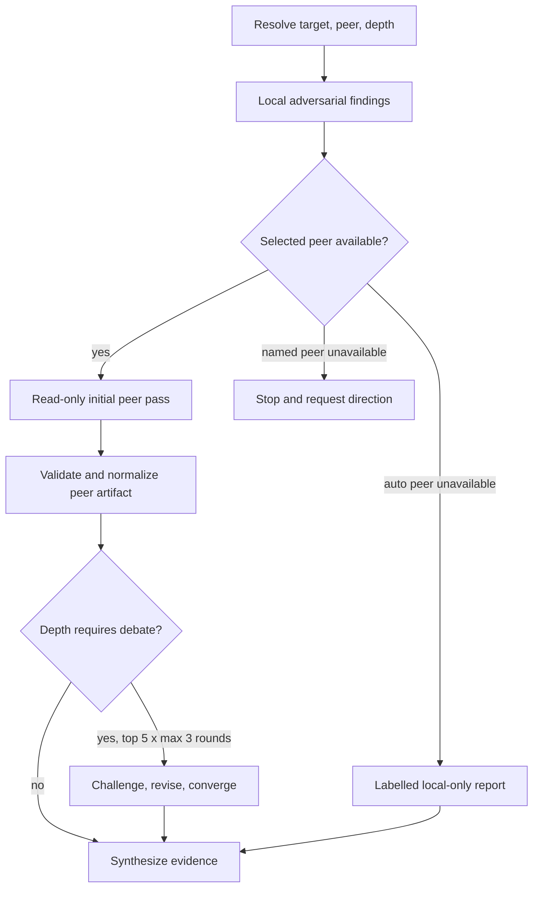

# feat: Harden adversarial peer review

## Overview

Evolve `ce-adversarial-review` from a single independent pass into a safe, bounded cross-harness review workflow. The skill will retain a strictly read-only peer, add quick/auto/deep review depth, and resolve material findings through evidence-backed rebuttal rather than merely merging two lists.

---

## Problem Frame

The current skill can invoke the other authenticated harness, but the Codex invocation does not close stdin or preserve stderr, and the workflow cannot distinguish an independently confirmed concern from a disagreement. External references demonstrate useful patterns, but CE must keep its existing portability, explicit evidence, privacy, and no-silent-peer-claim guarantees.

---

## Requirements Trace

- R1. The Claude Code and Codex peer commands must be noninteractive, read-only, target the resolved repository, close stdin, preserve a validated peer artifact plus an error artifact, and apply the strongest portable confidentiality controls available.
- R2. The skill must support `depth:quick|auto|deep`, with a bounded evidence-based challenge loop for material findings.
- R3. A requested named peer that is unavailable must not silently be represented as a cross-harness review; `peer:auto` may retain a visibly labelled local-only fallback.
- R4. Final reports must distinguish independently corroborated findings, converged-after-rebuttal findings, dismissed findings, budget-deferred findings, and unresolved disagreements with target evidence.
- R5. The portable skill and its deterministic/behavioral contracts must validate in the source skill and each generated target with a relevant skill-output test.

---

## Scope Boundaries

- No installation, credential, MCP, or billing changes.
- No modification of the reviewed target during any review or debate turn.
- No unbounded model conversation, resume session, or parallel fan-out; a review debates at most five prioritized findings for three rounds each.
- No assertion that a peer ran unless a validated peer artifact exists.

---

## Context & Research

### Relevant Code and Patterns

- `plugins/ce-datascience/skills/ce-adversarial-review/SKILL.md` defines target selection, local review, peer dispatch, and report format.
- `plugins/ce-datascience/skills/ce-adversarial-review/references/peer-review-contract.md` owns the peer CLI contract and prompt.
- `tests/adversarial-review-skill-contract.test.ts` provides focused static contract coverage.
- `evals/ce-datascience/cases/ce-adversarial-review-local-plan/` is the existing synthetic behavioral case.
- `docs/solutions/skill-design/predictable-skill-authoring.md` requires checkable workflow phases and self-contained skill references.

### External References

- [skills-directory/skill-codex](https://github.com/skills-directory/skill-codex/blob/main/plugins/skill-codex/skills/codex/SKILL.md): close stdin for noninteractive Codex invocations and use a read-only sandbox for review.
- [schneidenbach/codex-review-skills](https://github.com/schneidenbach/codex-review-skills/blob/master/skills/claude-review/SKILL.md): depth modes, structured peer-output validation, bounded rebuttal, and explicit confirmed/unresolved outcomes.

---

## Key Technical Decisions

- **Use one cross-harness skill, not four harness-specific commands.** `peer:auto` selects the other harness; named peers provide an explicit override. This keeps CE's conversion surface small while preserving both directions.
- **Keep the peer read-only and minimise confidentiality exposure.** Do not import the reference implementation's unrestricted Claude CLI behavior. Claude remains restricted to `Read,Grep,Glob`; Codex remains `--sandbox read-only`. Implementation must first verify each CLI's supported repository-scoping, network/MCP-disablement, and environment-isolation controls; where a platform cannot enforce a control, the final skill documents that limitation rather than claiming a confidentiality boundary.
- **Make failure semantics explicit.** `peer:auto` degrades only to `local-only (peer unavailable)` with the failed check recorded. `peer:claude` or `peer:codex` failure stops for user direction rather than silently changing requested coverage.
- **Normalize before debate.** Peer output is a size-bounded JSON finding record with a repository-relative location, fixed priority/confidence values, bounded evidence text, and no executable instructions. A validator rejects malformed or out-of-repository records; the driver reads only normalized records, never the raw peer response.
- **Bound debate to five prioritized findings and three rounds per finding.** `quick` performs one peer pass; `auto` debates materially different P0-P2 records; `deep` debates eligible P0-P2 records. Sort by P0 -> P3 then confidence, retain at most five, and label the remainder `not debated due to budget`. A finding is `independently corroborated` only when both initial passes independently support it; later agreement is `converged after rebuttal`.
- **Keep peer model selection reproducible without imposing a provider default.** Accept optional peer model/reasoning-effort tokens for Codex dispatch; when omitted, record that the authenticated Codex profile selected the model. Do not invent analogous unsupported flags for Claude.

---

## High-Level Technical Design

> *This illustrates the intended approach and is directional guidance for review, not implementation specification. The implementing agent should treat it as context, not code to reproduce.*

---

## Implementation Units

- U1. **Harden the peer execution contract**

**Goal:** Make the Claude and Codex invocations safely noninteractive, artifact-complete, and explicit about their confidentiality limits.

**Requirements:** R1, R5

**Dependencies:** None

**Files:**
- Modify: `plugins/ce-datascience/skills/ce-adversarial-review/references/peer-review-contract.md`
- Create: `plugins/ce-datascience/skills/ce-adversarial-review/scripts/validate_peer_artifact.py`
- Modify: `tests/adversarial-review-skill-contract.test.ts`

**Approach:** Update the Codex command to close stdin, capture stderr in `peer.stderr`, retain `--sandbox read-only`, and allow non-Git plan targets with the documented Git-check override. Change the peer prompt to emit a size-bounded JSON record and add a standard-library Python validator that accepts only fixed fields, valid priority/confidence values, repository-relative locations, and bounded evidence. Preserve raw `peer.md` for diagnostics but never feed it into synthesis or debate; pass only the normalized artifact onward. Create run directories atomically with owner-only permissions, set artifact permissions explicitly, and delete them after a documented bounded retention period unless the user requests debugging retention. Verify which additional sandbox, network/MCP, and environment controls each CLI actually supports before documenting them; do not promise repository read confinement if a CLI cannot enforce it.

**Patterns to follow:** The existing Claude peer command's explicit repository change, stdout, and stderr artifacts; current Codex CLI help for supported flags.

**Test scenarios:**
- Happy path: static contract confirms both peers write `peer.md` and `peer.stderr`, run from the resolved repository, and produce a normalized artifact accepted by the validator.
- Edge case: Codex command includes closed stdin so a harness without a TTY cannot hang.
- Error path: a nonzero peer command leaves an inspectable error artifact without claiming review coverage; raw artifact absence is represented explicitly rather than fabricated.
- Security: oversized, malformed, out-of-repository, credential-like, and prompt-injection-bearing peer artifacts are rejected before synthesis; temporary artifacts are private and are cleaned up under the retention policy.

**Verification:** Focused contract and validator tests fail if either command loses read-only containment, artifact capture, noninteractive closure, normalized-input handling, or private-artifact lifecycle guarantees.

---

- U2. **Add depth-aware peer triage and rebuttal**

**Goal:** Turn normalized independent peer findings into precisely labelled corroborated, converged, dismissed, budget-deferred, or unresolved outcomes.

**Requirements:** R2, R3, R4

**Dependencies:** U1

**Files:**
- Modify: `plugins/ce-datascience/skills/ce-adversarial-review/SKILL.md`
- Create: `plugins/ce-datascience/skills/ce-adversarial-review/references/debate-protocol.md`
- Modify: `plugins/ce-datascience/skills/ce-adversarial-review/references/peer-review-contract.md`
- Modify: `tests/adversarial-review-skill-contract.test.ts`

**Approach:** Add a `depth:` argument and concise mode-selection rules. Use only U1's normalized records for triage. Define one stable finding identity from normalized location, claim, trigger/path, severity, confidence, and evidence; define a material difference as a matching identity with conflicting consequence or disposition. In auto/deep mode, pass only one normalized record plus the driver's counterevidence into a maximum-three-round peer response. Require every round to cite the target location; stop once corroborated, converged, dismissed, or exhausted. Prioritize P0 -> P3 and then confidence; select at most five eligible findings and label the rest budget-deferred. Update peer availability semantics so explicit named-peer failures require user direction and automatic selection produces the existing labelled local-only outcome.

**Patterns to follow:** CE skill-local reference isolation; bounded convergence and output validation from the external review reference, adapted to CE's read-only permissions and explicit evidence policy.

**Test scenarios:**
- Happy path: `depth:quick` performs synthesis after one validated peer pass; auto/deep produce the expected corroborated, converged, dismissed, unresolved, and budget-deferred states.
- Edge case: all-info or already independently corroborated findings do not enter debate; ten eligible findings deterministically select the top five and defer the remainder.
- Error path: malformed/empty peer output and explicit-peer authentication failures cannot be labelled cross-harness coverage.
- Integration: a peer-retracted concern is omitted from blocking findings but retained, if useful, as a dismissed observation with reason.

**Verification:** The skill has a self-contained, checkable completion rule for each phase and its final report exposes mode, coverage, initial independent positions, round count, budget-deferred count, and disposition.

---

- U3. **Strengthen portable contracts and behavioral evaluation**

**Goal:** Prevent future regressions in routing, debate bounds, peer-failure semantics, and evidence-backed reporting.

**Requirements:** R3, R4, R5

**Dependencies:** U1, U2

**Files:**
- Modify: `tests/adversarial-review-skill-contract.test.ts`
- Modify: `tests/behavioral-eval-contract.test.ts`
- Modify: `evals/ce-datascience/cases/ce-adversarial-review-local-plan/case.yaml`
- Modify: `evals/ce-datascience/cases/ce-adversarial-review-local-plan/prompt.md`
- Create: `evals/ce-datascience/cases/ce-adversarial-review-local-code/`
- Create: `evals/ce-datascience/cases/ce-adversarial-review-scripted-peer/`
- Modify: `tests/plugin-content-portability.test.ts`
- Modify: `tests/codex-writer.test.ts`, `tests/opencode-writer.test.ts`, `tests/pi-writer.test.ts`, `tests/gemini-writer.test.ts`, and `tests/kiro-writer.test.ts`

**Approach:** Cover command and artifact-validation invariants directly in focused tests. Extend the plan case to exercise explicit local `depth:quick` output and disposition labels. Add a synthetic, fixture-backed code-diff case that requires target locations, failure scenario, read-only behavior, and absence of unsupported peer claims. Add a credential-independent scripted-peer case with accepted and rejected transcript fixtures that exercises auto/deep triage, disagreement, retraction, malformed output, budget exhaustion, and no arbitrary peer-text replay. Keep actual CLI availability checks in deterministic contract tests, then run a separately documented, manually gated live-peer acceptance pass for each harness.

**Execution note:** Define fixtures and deterministic acceptance contracts alongside U2's prose changes, then run two independent fresh-context evaluations after deterministic validation passes.

**Patterns to follow:** Existing case hashes, hard gates, source binding, and fail-closed scoring under `evals/ce-datascience/cases/`.

**Test scenarios:**
- Happy path: plan and code fixtures produce structured local-only quick reports with evidence locations; scripted artifacts yield independently corroborated and converged outcomes.
- Edge case: a finding without a target location cannot become confirmed; ten eligible records retain the deterministic top five.
- Error path: explicit-peer failure, malformed/oversized artifact, and a transcript containing a command-like instruction are visibly non-peer or rejected-artifact outcomes.
- Integration: case discovery, frozen fixture hashes, source binding, and converted skill output remain valid after adding both new cases.

**Verification:** `bun run eval:validate` accepts the cases; scripted and local cases pass twice in independent fresh contexts; Codex, OpenCode, Pi, Gemini, and Kiro writer tests each inspect the generated skill for co-located references and portable text; and a manually gated live-peer acceptance pass exercises each authenticated direction without committing peer artifacts.

---

- U4. **Document the final review contract and conversion expectations**

**Goal:** Make the advanced adversarial-review behavior discoverable without overstating live peer guarantees.

**Requirements:** R2, R3, R4, R5

**Dependencies:** U2, U3

**Files:**
- Modify: `plugins/ce-datascience/README.md`
- Modify: `README.md` only if the public inventory or top-level capability wording changes

**Approach:** Update the skill catalog description with quick/auto/deep behavior, read-only peer selection, bounded debate, and corroborated/converged/unresolved dispositions. Explain that a named unavailable peer requires user direction while automatic peer selection can produce labelled local-only coverage. State that peer artifacts are normalized before use and that read-only permissions do not themselves guarantee confidentiality. Do not publish credentials, provider-specific pricing, or a claim that cross-model quality is guaranteed.

**Test expectation:** none -- documentation-only change; release metadata validation confirms inventory consistency.

**Verification:** Documentation describes the same token syntax, safety boundary, and fallback semantics as the runtime skill.

---

## System-Wide Impact

- **Interaction graph:** The new skill-local debate reference and validator are copied with the skill into Claude Code, Codex, OpenCode, and other converted targets; generated-output tests verify co-location and references.
- **Error propagation:** Peer availability, rejected artifacts, malformed output, and bounded-debate exhaustion are rendered as coverage/disposition evidence rather than hidden execution failures.
- **State lifecycle risks:** Raw peer transcripts stay in private, temporary run directories with a bounded cleanup policy; normalized records only are used for debate; no durable session resume state is created.
- **Unchanged invariants:** Existing local-only review remains read-only; MCP use remains optional, preconfigured-only, and prohibited from configuring or retrying metered integrations.

---

## Risks & Dependencies

| Risk | Mitigation |
|---|---|
| Debate increases latency or token usage | Top-five selection and three-round-per-finding cap; quick mode remains single-pass. |
| A peer follows repository prompt injection | Narrow prompt, read-only tools, normalized-size-bounded artifacts, never replay raw output, and reject malformed records. |
| Read-only peer exposes sensitive local content | Verify available CLI isolation controls; minimize ambient environment/network/MCP access, use private temporary artifacts, and document any unenforceable limitation. |
| Claude/Codex CLI options drift | Validate against installed CLI help during implementation and encode only supported flags. |
| Live-model behavior differs across runs | Require two fresh-context scored runs; do not equate deterministic tests with behavioral proof. |

---

## Documentation / Operational Notes

- Restart active Claude Code and Codex sessions after installation or conversion so cached skill definitions reload.
- Keep Tavily and Ref MCP optional; report their unavailability as a verification gap rather than a peer-review failure.

---

## Sources & References

- Related skill: `plugins/ce-datascience/skills/ce-adversarial-review/SKILL.md`
- Peer contract: `plugins/ce-datascience/skills/ce-adversarial-review/references/peer-review-contract.md`
- Behavioral case: `evals/ce-datascience/cases/ce-adversarial-review-local-plan/case.yaml`
- External: [skills-directory/skill-codex](https://github.com/skills-directory/skill-codex)
- External: [schneidenbach/codex-review-skills](https://github.com/schneidenbach/codex-review-skills)
