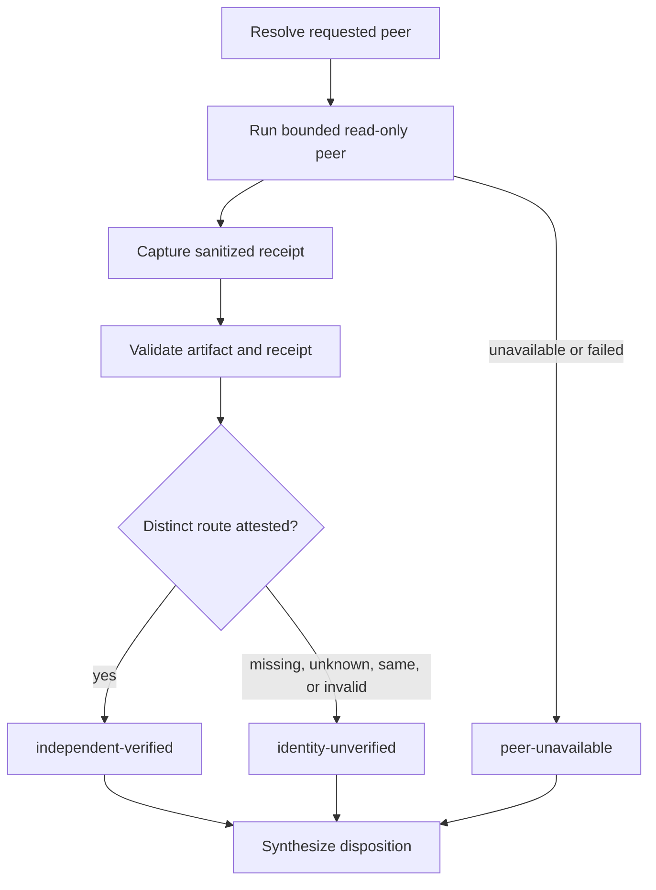

# feat: Harden cross-model adversarial review

## Overview

This follow-up selectively adopts the useful cross-model review controls from the latest `EveryInc/compound-engineering-plugin` master: truthful peer identity and route attestation, structured execution receipts, bounded failure semantics, and fixture-backed contract coverage. It extends CE's existing Claude/Codex adversarial-review capability without importing the upstream multi-provider shell runner or claiming independence that cannot be verified.

---

## Problem Frame

`ce-adversarial-review` can request the other supported harness, normalize its findings, and run a bounded rebuttal. Its report currently proves that an artifact was accepted, but does not define a portable evidence contract for which provider or model actually served the peer request. A review called "cross-model" must remain honest when route identity is unknown, the requested peer is unavailable, or a wrapper maps multiple client names to the same serving route.

---

## Requirements Trace

### Attestation

- R1. A review is labelled independently cross-harness only when a wrapper-owned, machine-readable, validated receipt supports a provider/route distinct from the initiating harness. In the absence of such a source, successful Claude and Codex peer runs are labelled `identity-unverified`; a peer self-report can never promote coverage.

### Receipt contract

- R2. The local wrapper writes a bounded receipt with requested peer, trusted identity evidence when available, artifact paths, exit status, bounded duration, and failure category without exposing credentials, raw environment values, command text, or unbounded transcripts.

### Supported peers

- R3. Claude and Codex remain the only supported live peers for this capability; unknown wrappers and future providers fail closed or remain explicitly unverified.

### Deterministic verification

- R4. Deterministic tests cover success, unavailable peer, malformed receipt, same-route evidence, unknown route, timeout, and artifact-validation paths without requiring credentials or live model calls.

### Fresh-context acceptance

- R5. A manually gated, fresh-context acceptance procedure verifies each installed direction and records only sanitized evidence; it does not treat a static contract or a successful command launch as proof of independent model serving.

---

## Scope Boundaries

- Do not import or depend on the upstream `cross-model-adversarial-review.sh` orchestration script.
- Do not add providers beyond Claude Code and Codex, install CLIs, alter credentials, or configure MCP services.
- Do not send more repository content than the existing bounded peer prompt requires.
- Do not make routing, model identity, or confidentiality claims when the installed CLI cannot attest them.

### Deferred to Follow-Up Work

- Additional provider adapters: only after a stable documented identity/route receipt contract exists for that provider.
- Persistent job queues, resumable conversations, telemetry, and automatic retries: intentionally excluded to preserve bounded, local review behavior.

---

## Context & Research

### Relevant Code and Patterns

- `plugins/ce-datascience/skills/ce-adversarial-review/SKILL.md` owns peer selection, review coverage labels, and synthesis.
- `plugins/ce-datascience/skills/ce-adversarial-review/references/peer-review-contract.md` owns portable peer invocation and artifact requirements.
- `plugins/ce-datascience/skills/ce-adversarial-review/scripts/validate_peer_artifact.py` is the existing standard-library boundary that rejects untrusted peer output before synthesis.
- `tests/adversarial-peer-artifact.test.ts` and `tests/adversarial-review-skill-contract.test.ts` are the focused deterministic contracts.
- `evals/ce-datascience/cases/ce-adversarial-review-*` supplies frozen, source-bound behavioral cases.

### External References

- [EveryInc compound-engineering-plugin master](https://github.com/EveryInc/compound-engineering-plugin): cross-model review examples that distinguish request identity, route identity, artifact schema, and failed coverage. Reviewed at commit `fea76d4396aaebc6e0dadd9ce03765345000f6fe`.
- [Anthropic Claude Code documentation](https://docs.anthropic.com/en/docs/claude-code): verify any Claude CLI identity or noninteractive option against the installed command help before encoding it.
- [OpenAI Codex documentation](https://developers.openai.com/codex/): verify any Codex CLI identity or noninteractive option against the installed command help before encoding it.

---

## Key Technical Decisions

- **Use four canonical coverage states, not a boolean cross-model claim.** The report distinguishes `independent-verified`, `identity-unverified`, `peer-unavailable`, and `local-only`. Same-route, unknown-route, missing-route, and invalid-receipt conditions are reason codes within `identity-unverified`; only `independent-verified` can promote independent corroboration.
- **Treat requested identity and served identity as separate fields.** A user can request `peer:codex` or `peer:claude`; the result must not silently infer that the provider/model selected by a wrapper matches that request.
- **Keep receipts small, deterministic, and sanitized.** The wrapper writes `receipt.json` separately from peer-owned `peer.md`, containing only fixed `command_kind`/capability enums, timestamps/duration, exit classification, run-directory-relative artifact hashes/paths, and recognized identity evidence. Raw response text, command text, and environment values are never copied into the receipt.
- **Fail closed on unsupported attestations.** The initial capability probe must name the exact wrapper-owned, machine-readable evidence source. If the installed CLI exposes no such source—as is currently expected for the existing Claude and Codex peer commands—`independent-verified` is unreachable and the successful-peer outcome is `identity-unverified`.
- **Adapt interfaces, not upstream implementation.** Use CE skill-local references, the existing Python validator, TypeScript contracts, and frozen eval fixtures instead of importing a thousand-line shell workflow with providers CE does not support.

---

## High-Level Technical Design

> *This illustrates the intended approach and is directional guidance for review, not implementation specification. The implementing agent should treat it as context, not code to reproduce.*

---

## Implementation Units

- U1. **Define the portable peer-attestation contract**

**Goal:** Define exactly which wrapper-owned evidence can support independent cross-harness coverage, and make the unverified outcome explicit when neither installed CLI exposes it.

**Requirements:** R1, R2, R3

**Dependencies:** None

**Files:**
- Modify: `plugins/ce-datascience/skills/ce-adversarial-review/references/peer-review-contract.md`
- Modify: `plugins/ce-datascience/skills/ce-adversarial-review/SKILL.md`
- Modify: `tests/adversarial-review-skill-contract.test.ts`

**Approach:** Before adding a positive identity path, inspect and document the exact installed CLI capability probe and its trust boundary. Do not accept peer-generated identity claims. Define a wrapper-owned `receipt.json` produced after command completion plus a closed coverage matrix: `independent-verified`, `identity-unverified`, `peer-unavailable`, and `local-only`. `peer.md` stays peer-owned; the receipt separately records requested peer, command kind enum, artifact status, and attestation reason. Preserve explicit named-peer failure stop, while automatic selection produces a final local-only report. Add a peer-mode × failure-category matrix: named unavailable/preflight/nonzero/timeout stops before synthesis and returns the audited receipt plus local findings for user direction; automatic failure retains local findings in a `peer-unavailable` report; explicit `peer:local` stays `local-only`.

**Patterns to follow:** Current peer artifact contract's fixed fields and CE's explicit local-only/failure semantics.

**Test scenarios:**
- Happy path: only a receipt from a documented wrapper-owned distinct-route source yields `independent-verified` coverage.
- Edge case: a successful Claude or Codex run with no documented trusted route source is `identity-unverified`, even if its peer response names a model.
- Error path: missing, malformed, or same-route receipt evidence is labelled `identity-unverified`, never independently corroborated.
- Integration: each named/automatic/local peer mode and unavailable/preflight/nonzero/timeout failure combination yields the matrix's defined stop/fallback/report outcome.

**Verification:** The skill contains one unambiguous coverage-and-failure matrix and contracts reject a report that promotes peer-asserted or unverified identity to independent corroboration.

---

- U2. **Validate and sanitize execution receipts**

**Goal:** Extend the existing artifact boundary so untrusted execution metadata cannot alter coverage labels or leak sensitive local context.

**Requirements:** R1, R2, R4

**Dependencies:** U1

**Files:**
- Modify: `plugins/ce-datascience/skills/ce-adversarial-review/scripts/validate_peer_artifact.py`
- Modify: `tests/adversarial-peer-artifact.test.ts`
- Modify: `tests/adversarial-review-skill-contract.test.ts`

**Approach:** Keep `peer.md` peer-only. Have the local wrapper atomically write `receipt.json` after process termination for success, preflight failure, timeout, nonzero exit, and validator rejection. Invoke validation with the peer artifact, receipt, and canonical run directory; produce one normalized record containing artifact state, receipt state, and coverage state. Allow only bounded ASCII identifiers, fixed enum states, safe paths resolving inside that run directory, numeric bounded durations, and explicitly redacted diagnostic categories. Reject raw environment captures, credentials, absolute paths, executable fields, free-form command text, oversized values, and unknown state transitions. Partial stdout/stderr is diagnostic only and is never synthesized.

**Execution note:** Start with failing validator fixtures for each rejected field and then add the accepted minimal receipt.

**Patterns to follow:** `validate_peer_artifact.py` fail-closed validation and existing synthetic peer-artifact fixtures.

**Test scenarios:**
- Happy path: a minimal wrapper-written receipt normalizes to fixed fields and retains no raw command or environment values.
- Edge case: an allowed missing model field remains explicit while the receipt is otherwise valid.
- Error path: a receipt with an absolute path, credential-like string, unsupported provider, invalid duration, or command-like content is rejected before synthesis.
- Integration: a valid findings artifact with an invalid receipt results in unverified coverage, while a timeout receipt is valid without `peer.md` and partial output is never synthesized.

**Verification:** Validator tests prove that coverage state derives only from normalized, bounded receipt data.

---

- U3. **Make synthesis and debate route-aware**

**Goal:** Ensure corroboration and rebuttal labels reflect validated independence instead of merely two accepted texts.

**Requirements:** R1, R3

**Dependencies:** U1, U2

**Files:**
- Modify: `plugins/ce-datascience/skills/ce-adversarial-review/SKILL.md`
- Modify: `plugins/ce-datascience/skills/ce-adversarial-review/references/debate-protocol.md`
- Modify: `tests/adversarial-review-skill-contract.test.ts`

**Approach:** Gate `independently corroborated` on a normalized `independent-verified` receipt. When identity is unverified, retain the peer's evidence as a labelled secondary perspective but use `converged-after-rebuttal` or `unresolved` only as appropriate; never use language that implies separate model evidence. Only automatic-peer success with a valid finding artifact is debate-eligible; named peer failures stop before synthesis and automatic failures produce `peer-unavailable`. Keep existing depth and five-finding/three-round limits unchanged.

**Patterns to follow:** Existing disposition vocabulary, bounded debate protocol, and the local-only fallback report.

**Test scenarios:**
- Happy path: a documented wrapper-attested distinct-route receipt and matching evidence produce an independently corroborated finding.
- Edge case: matching findings from an identity-unverified peer remain visible but cannot receive the independent label.
- Error path: unavailable or rejected receipts prevent debate from claiming cross-harness confirmation.
- Integration: `depth:quick`, `depth:auto`, and `depth:deep` preserve their current budget limits and report the coverage state beside each disposition.

**Verification:** Every synthesis state has a defined relationship to receipt validation, and no path allows a missing receipt to upgrade a finding.

---

- U4. **Add deterministic and fresh-context acceptance coverage**

**Goal:** Prove the portable contract in fixtures and provide a repeatable, privacy-conscious manual acceptance procedure for each installed harness direction.

**Requirements:** R4, R5

**Dependencies:** U1, U2, U3

**Files:**
- Modify: `tests/adversarial-peer-artifact.test.ts`
- Modify: `tests/adversarial-review-skill-contract.test.ts`
- Modify: `tests/behavioral-eval-contract.test.ts`
- Create: `evals/ce-datascience/cases/ce-adversarial-review-identity-contract/`
- Modify: `plugins/ce-datascience/skills/ce-adversarial-review/SKILL.md`
- Modify: `plugins/ce-datascience/README.md`

**Approach:** Add frozen receipt fixtures covering wrapper-attested distinct route, no trusted identity source, same route, bad schema, named and automatic unavailable peer, nonzero exit, and timeout. Add a behavioral case that requires truthful labels without invoking a real peer. Document a separately manually gated acceptance checklist: run each direction in two fresh harness contexts, retain only sanitized receipt evidence under `/tmp/ce-datascience/behavioral-evals/`, score the case, and never commit live artifacts. Confirm converted target output keeps all references co-located. The checklist explicitly records that a successful current CLI invocation is an `identity-unverified` acceptance result unless the capability probe verifies a trusted source.

**Patterns to follow:** Existing `evals/ce-datascience` hash/source binding, fresh-context policy, and `plugin-content-portability` tests.

**Test scenarios:**
- Happy path: synthetic distinct-route fixture reports independent verification and passes case scoring.
- Edge case: each absent identity field produces an explicit unverified label rather than fixture failure or invented evidence.
- Error path: peer timeout, nonzero exit, and invalid receipt leave auditable local-only/unavailable coverage with no model claim.
- Integration: deterministic validation finds the new case, writer/portability tests preserve self-contained references, and both installed directions execute only in manually gated fresh contexts.

**Verification:** Contract tests and `eval:validate` cover every receipt state; two fresh-context runs per real direction produce sanitized evidence or explicitly record the external gate.

---

## System-Wide Impact

- **Interaction graph:** The peer command produces findings plus a receipt; the validator produces normalized records; synthesis and debate consume only normalized records; the final report renders coverage and disposition together.
- **Error propagation:** An unavailable peer, failed command, or invalid receipt changes coverage state without erasing local findings or implying a second independent review.
- **State lifecycle risks:** Private temporary artifacts remain bounded and cleanup-managed; sanitized receipts expose no credentials, absolute paths, or raw environment data.
- **API surface parity:** Claude and Codex use the same semantic receipt states, while their evidence acquisition remains CLI-specific and capability-checked.
- **Unchanged invariants:** The review peer remains read-only, no additional provider/MCP installation occurs, and `peer:auto` never silently claims a peer ran.

---

## Risks & Dependencies

| Risk | Mitigation |
|---|---|
| CLI identity metadata is unavailable or changes | Capability-check against installed help; emit unverified state rather than guessing; retain focused fixtures for the fallback. |
| A wrapper maps both clients to one serving route | Require route-distinct evidence before the independent label; same/unknown route remains explicitly unverified. |
| Receipt fields leak local context | Fixed allowlist, redaction, bounded fields, and validator rejection before persistence or synthesis. |
| Upstream design expands review scope | Restrict to two existing peers and adapt only receipt/validation semantics. |
| Live harness testing is flaky or credential-gated | Keep CI deterministic; require two fresh-context manually gated attempts and report the gate honestly. |

---

## Documentation / Operational Notes

- Describe coverage labels and their meaning in the skill catalog without promising model diversity or confidentiality beyond verified CLI controls.
- Keep the live acceptance procedure outside normal CI and never commit live response artifacts, prompts, credentials, or repository content.

---

## Sources & References

- Existing peer-debate plan: `docs/plans/2026-07-31-001-feat-adversarial-peer-debate-plan.md`
- Peer contract: `plugins/ce-datascience/skills/ce-adversarial-review/references/peer-review-contract.md`
- Validator: `plugins/ce-datascience/skills/ce-adversarial-review/scripts/validate_peer_artifact.py`
- Upstream reference: [EveryInc/compound-engineering-plugin](https://github.com/EveryInc/compound-engineering-plugin) at `fea76d4396aaebc6e0dadd9ce03765345000f6fe`
