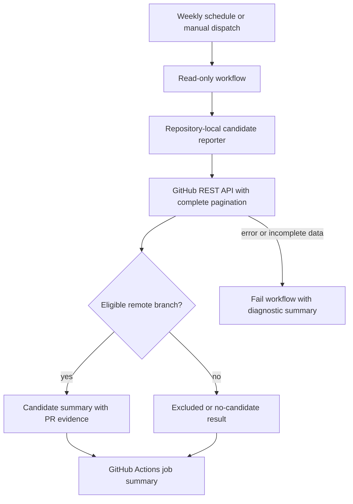

# feat: Add safe weekly branch-maintenance reporting

## Goal Capsule

- **Objective:** Make stale remote-branch candidates visible every week without risking user work or repository state.
- **Means:** A dedicated, read-only scheduled GitHub Actions workflow and a testable repository-local reporter. (KTD1, KTD2)
- **Authority:** The scheduled workflow may only inspect and report. The existing interactive cleanup skill remains the only deletion path.
- **Stop conditions:** Do not delete refs, worktrees, branches, or files; do not create issues or modify repository state; fail rather than report a falsely complete result after an API error.

---

## Product Contract

### Summary

Add a weekly report for remote branches that appear ready for human-reviewed cleanup.
The report is a maintenance signal, not a cleanup command, and it directs local cleanup back to `ce-clean-gone-branches`.

### Problem Frame

Merged branches have accumulated in the repository, while the current cleanup workflow requires a developer to discover and inspect candidates manually.
A shared scheduled report can surface remote candidates consistently, but a hosted runner cannot see a developer's local branches or worktrees and must not automate destructive cleanup.

### Requirements

- R1. Run a dedicated workflow weekly and through manual dispatch, without extending CI or release automation.
- R2. Identify only remote branches that are not the default branch, are not protected, have no open pull request, and whose current head still matches a merged pull request.
- R3. Exclude branches with post-merge commits, protected branches, default branches, and branches with open pull requests.
- R4. Publish an explicit GitHub Actions job summary for both eligible candidates and the no-candidates case.
- R5. Use only read permissions and contain no branch, ref, worktree, issue, or repository mutations.
- R6. Fail with an actionable summary if GitHub API authentication, pagination, or rate-limit handling cannot establish a complete result.
- R7. Preserve the existing interactive `ce-clean-gone-branches` workflow as the only route to local branch and worktree deletion.

### Success Criteria

- A manual run and a scheduled run produce the same result for the same repository state.
- A maintainer can see why every reported branch is a candidate and can distinguish it from excluded branches.
- The workflow's token permissions and source contain no capability to mutate branches or repository content.

### Scope Boundaries

- **In scope:** Remote-branch reporting in GitHub Actions, its report formatter, manual dispatch, excluded-candidate counts, and automated tests.
- **Deferred to follow-up work:** A separate, explicitly approved remote-deletion workflow if maintainers later want one.
- **Outside this plan:** Local branch/worktree inventory, automatic deletion, scheduled GitHub Issues or notifications, and any release-automation changes.

### Acceptance Examples

- AE1. Given no qualifying remote branches, when the workflow runs, then it succeeds and its summary says that no candidates were found.
- AE2. Given a merged feature branch whose head has not changed, when the workflow runs, then the summary names the branch, merged pull request, merge date, head SHA, and manual follow-up path.
- AE3. Given a protected branch, an open-PR branch, or a branch with commits after its merged pull request, when the workflow runs, then it is not presented as cleanup-ready.
- AE4. Given a paginated API response or API failure, when the reporter cannot establish a complete result, then it does not emit a misleading empty success report.

---

## Planning Contract

### Key Technical Decisions

- KTD1. **Use scheduled GitHub Actions rather than a developer-machine cron job.** The job is shared, visible, manually runnable, and independent of one workstation; schedule it weekly at `23 17 * * 2` (Tuesday, 17:23 UTC) because GitHub schedules run from the default branch in UTC and can be delayed at the start of an hour. ([GitHub Actions schedule documentation](https://docs.github.com/en/actions/reference/workflows-and-actions/events-that-trigger-workflows#schedule))
- KTD2. **Report remote candidates only, with a read-only token.** A hosted runner has no durable access to developer-local tracking branches or worktrees, and report-only avoids turning a discovery signal into a destructive action. (session-settled: user-approved — chosen over automated cleanup or recurring Issues: lowest-risk shared maintenance path)
- KTD3. **Use a repository-local Bun reporter backed by the GitHub REST API.** This makes eligibility and pagination testable, avoids relying on a runner-specific CLI, and lets the workflow write a concise summary from structured results.
- KTD4. **Discover the default branch and require a matching merged pull request head.** Read the repository's configured default branch rather than assuming `main`, then require the current branch SHA to equal a merged pull request's head SHA. This rejects post-merge activity; default, protected, and open-PR branches remain excluded even if an older pull request merged.

### High-Level Technical Design

### Assumptions

- GitHub's default `GITHUB_TOKEN` can read repository branches and pull requests when the workflow explicitly grants `contents: read` and `pull-requests: read`.
- GitHub Actions run summaries are sufficient for weekly visibility; the plan intentionally does not add an Issue, email, chat message, or durable artifact history.

### System-Wide Impact

The new workflow is isolated from CI and release automation, runs only from the default branch, and has read-only repository access.
It cannot replace the local cleanup skill: its environment is ephemeral and remote-visible state does not prove that a developer-local branch or worktree is safe to remove.

### Risks and Dependencies

- GitHub can delay scheduled workflows and can disable schedules in inactive public repositories; keep `workflow_dispatch` as the recovery and verification path. ([GitHub Actions schedule documentation](https://docs.github.com/en/actions/reference/workflows-and-actions/events-that-trigger-workflows#schedule))
- API pagination, authorization, or rate limits can hide branches or pull requests; treat incomplete retrieval as a workflow failure, never as an empty report.
- Workflow tokens inherit platform defaults unless constrained; declare job permissions because GitHub recommends least privilege for `GITHUB_TOKEN`. ([GitHub Actions permissions documentation](https://docs.github.com/en/actions/reference/workflows-and-actions/workflow-syntax#permissions))

---

## Implementation Units

### U1. Build the remote-branch candidate reporter

- **Goal:** Produce structured, evidence-backed candidate and exclusion results from GitHub's remote branch and pull-request state.
- **Requirements:** R2, R3, R6, R7; Covers AE2, AE3, AE4.
- **Dependencies:** None.
- **Files:** `scripts/maintenance/report-branch-candidates.ts`, `tests/branch-maintenance-report.test.ts`.
- **Approach:** Retrieve repository metadata first to discover the default branch, then fetch every required REST API page before classifying results. Keep API retrieval, eligibility classification, and Markdown summary rendering separately testable within the one script. Require the current branch SHA to match a merged pull request's head SHA, and retain the pull request number, URL, merge time, SHA, and exclusion reason for output. Return candidate evidence plus aggregate exclusion counts; do not present excluded branches as cleanup-ready.
- **Patterns to follow:** `scripts/release/preview.ts` for repository-local Bun scripts; `plugins/ce-datascience/skills/ce-clean-gone-branches/scripts/clean-gone` for discovery-only posture.
- **Test scenarios:**
  - Covers AE1. An empty eligible set renders a successful explicit no-candidates summary.
  - Covers AE2. A non-protected remote branch with a matching merged pull request is emitted with its evidence fields and manual-cleanup wording.
  - Covers AE3. Default, protected, and open-PR branches are excluded even when an older merged pull request exists.
  - Covers AE3. A branch whose current SHA differs from the merged pull request head is excluded as post-merge activity.
  - Covers AE4. Multi-page branch or pull-request responses are fully consumed before classification.
  - Covers AE4. Authentication, rate-limit, malformed-response, and pagination-link failures return an error rather than an empty success report.
- **Verification:** Deterministic tests prove candidate classification and summary output without contacting GitHub.

### U2. Add the read-only weekly workflow

- **Goal:** Schedule and manually expose the reporter without granting mutation capability.
- **Requirements:** R1, R4, R5, R6; Covers AE1, AE4.
- **Dependencies:** U1.
- **Files:** `.github/workflows/branch-maintenance.yml`, `tests/branch-maintenance-workflow.test.ts`.
- **Approach:** Create a dedicated workflow with the `23 17 * * 2` UTC schedule and `workflow_dispatch`. Check out the default-branch source, run the reporter, append its result to `GITHUB_STEP_SUMMARY`, and declare only `contents: read` and `pull-requests: read`. Preserve a diagnostic summary before failing on retrieval errors. Do not add a concurrency cancellation policy that could discard the only weekly result.
- **Patterns to follow:** `.github/workflows/release-preview.yml` for a side-effect-free manual workflow and job summaries; `.github/workflows/ci.yml` for Bun setup and repository validation conventions.
- **Test scenarios:**
  - A static workflow assertion verifies both `schedule` and `workflow_dispatch` triggers exist.
  - A static workflow assertion verifies only read scopes are granted and no write scope or deletion command appears.
  - The manual trigger supplies the same report path as the scheduled trigger and labels the triggering mode in its summary.
  - A reporter failure causes the workflow to fail after writing an actionable diagnostic summary.
- **Verification:** YAML parsing plus focused workflow assertions prove the non-destructive contract before GitHub-hosted smoke validation.

### U3. Document the human cleanup handoff

- **Goal:** Make it unambiguous that the report recommends inspection, not deletion.
- **Requirements:** R4, R7; Covers AE2.
- **Dependencies:** U1, U2.
- **Files:** `README.md`.
- **Approach:** Add a compact maintenance note that links the scheduled report and the existing interactive cleanup skill, names the local-versus-remote limitation, and states that deletions require separate confirmation.
- **Patterns to follow:** `plugins/ce-datascience/README.md` skill inventory language for concise, outcome-led descriptions.
- **Test expectation:** none -- documentation text has no independent runtime behavior; workflow and reporter tests cover the safety contract.
- **Verification:** README links resolve to the workflow and cleanup entrypoint without claiming automatic deletion.

---

## Verification Contract

| Gate | Applies to | Done signal |
| --- | --- | --- |
| Focused reporter tests | U1 | Candidate, exclusion, pagination, and error behavior are deterministic. |
| Focused workflow tests | U2 | Trigger, read-only permission, and no-mutation assertions pass. |
| Typecheck | U1 | The Bun/TypeScript reporter typechecks. |
| Repository tests | U1-U3 | `bun test` passes. |
| Release metadata validation | U2-U3 | `bun run release:validate` remains synchronized. |
| GitHub smoke test | U2 | A manual dispatch on the merged default branch produces a visible summary and no repository mutation. |

---

## Definition of Done

- U1-U3 are implemented with their listed test scenarios and verification outcomes.
- The weekly workflow reports remote candidates or an explicit no-candidates result, and fails honestly on incomplete API state.
- The workflow has no mutation commands and no write token permission.
- Manual cleanup remains a separate, explicit-confirmation activity.
- The documentation explains the report's remote-only boundary and human cleanup handoff.
- No abandoned implementation paths or unused maintenance artifacts remain in the diff.
