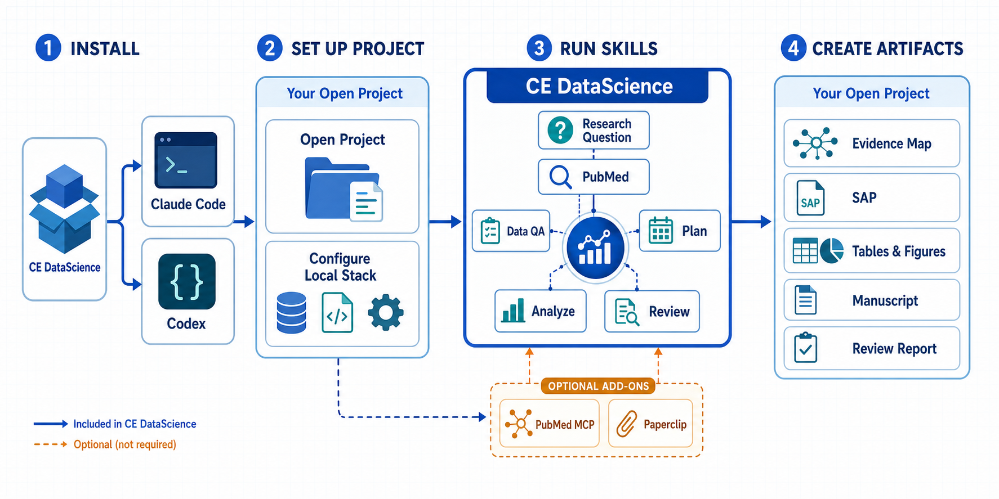
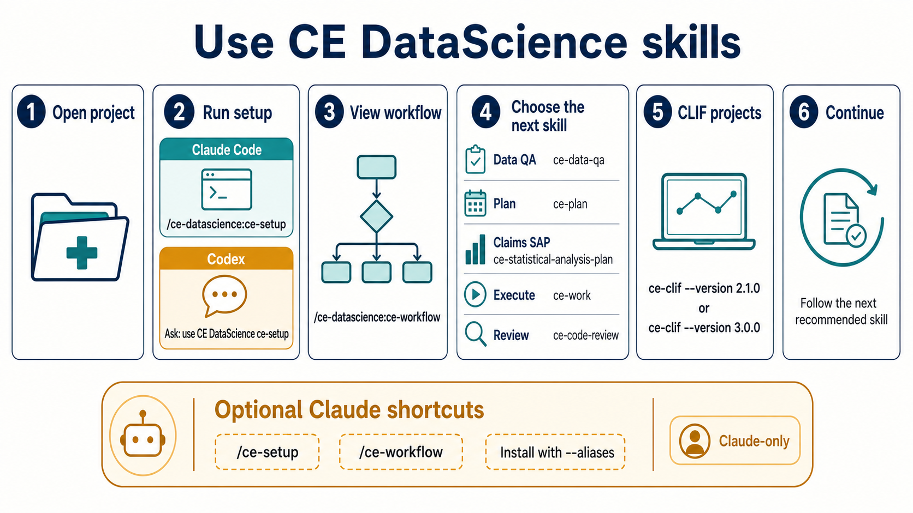

# CE DataScience

Compound engineering for computational scientists. SAP management, statistical review, and full reporting guideline compliance for R and Python workflows — covering 35 standards across all study types and AI extensions.

## How It Works





## Getting Started

For complete copy-paste setup across Claude Code, Codex, OpenCode, Gemini CLI,
Kiro, Pi, and Qwen Code, see [`../../docs/setup.md`](../../docs/setup.md).

Fastest normal Claude Code setup:

macOS, Linux, WSL, or Git Bash:

```bash
git clone https://github.com/sajor2000/ce-datascience.git ~/ce-datascience
cd ~/ce-datascience
bash install.sh claude --aliases
claude
```

Windows PowerShell:

```powershell
git clone https://github.com/sajor2000/ce-datascience.git "$HOME\ce-datascience"
cd "$HOME\ce-datascience"
.\install.ps1 claude -Aliases
claude
```

Then run `/ce-setup`. The alias flag gives you the same bare-command feel as
the original Compound Engineering plugin. Without aliases, use the native
namespaced form `/ce-datascience:ce-setup`.

Fastest normal Codex setup:

macOS, Linux, WSL, or Git Bash:

```bash
git clone https://github.com/sajor2000/ce-datascience.git ~/ce-datascience
cd ~/ce-datascience
bash install.sh codex
codex
```

Windows PowerShell:

```powershell
git clone https://github.com/sajor2000/ce-datascience.git "$HOME\ce-datascience"
cd "$HOME\ce-datascience"
.\install.ps1 codex
codex
```

Inside Codex, open `/plugins`, install **CE DataScience**, restart, then ask
Codex to use CE DataScience for setup.

### Use the plugin after installation

1. Restart Claude Code or Codex after installing the plugin.
2. Open the project or study directory where the work should happen.
3. Run setup once for that project.
4. Run workflow to see the lifecycle and next recommended skill.

Claude Code's native plugin commands are namespaced:

```text
/ce-datascience:ce-setup
/ce-datascience:ce-workflow
```

If the installer was run with `--aliases` or `-Aliases`, `/ce-setup` and
`/ce-workflow` are equivalent convenience aliases. In Codex, start a new task
and say:

```text
Use the CE DataScience ce-setup skill for this project.
Then use the CE DataScience ce-workflow skill and recommend the next step.
```

Setup records project-local stack and data-layer choices; it is not a global
one-time configuration for every study. Once workflow recommends a step, ask
the agent to use the named skill, such as `ce-research-question`, `ce-data-qa`,
`ce-plan`, or `ce-code-review`, and include the scientific or engineering goal.

Locked-down laptops can use approved local artifacts without Bun, Git, GitHub
CLI, or Quarto:

```bash
claude --plugin-dir /approved/path/ce-datascience
claude --plugin-dir /approved/path/ce-datascience.zip
```

In native Claude plugin installs, commands are namespaced:

```text
/ce-datascience:ce-setup --locked-down
/ce-datascience:ce-workflow
```

Bare commands such as `/ce-setup` require optional local alias files in
`.claude/commands`; they are not guaranteed by plugin loading itself.

After installing, run `/ce-datascience:ce-setup` in any project. It configures your stack
profile (language, IDE, libraries, reporting framework) and bootstraps project
config. Then run `/ce-datascience:ce-workflow` to see the ordered next steps
for the project. If optional aliases are installed, `/ce-setup` and
`/ce-workflow` work too.

Setup and workflow inspect available project evidence before asking. Each public
skill starts with a `Skill Value` block naming the problem it solves, when to use
it, expected output, question boundary, and non-goal so demos and first projects
route to the right command quickly.

Connection skills can hand setup a verified database default by emitting
`__CE_CONNECTION__ name=<name> type=<postgres|sqlite|duckdb|other> database=<db> auth=<auth> status=verified`.
For database-backed projects, `data_root` stays optional and is used only for
local extracts or cache files.

### Recommended research add-ons

The plugin's bundled `/ce-pubmed` workflow remains the portable baseline.
Optionally connect the PubMed MCP server,
[cyanheads/pubmed-mcp-server](https://github.com/cyanheads/pubmed-mcp-server)
for agent-native PubMed/Europe PMC, MeSH, citation, and related-article tools.
Add the
[Paperclip CLI and its official Paperclip skill, or its MCP server](https://paperclip.gxl.ai/docs)
when a study needs deeper full-text synthesis, claim verification, figures,
trials, regulatory documents, preprints, or biological databases. The skill is
fetched and maintained by Paperclip; CE DataScience does not bundle or fork it.
CE workflows currently auto-detect the Paperclip CLI only; external MCP or
provider-skill results are direct agent capabilities, not automatic CE artifact
handoffs.

Neither add-on is required or installed automatically. Review institutional
privacy and network policy before connecting hosted services. The canonical
configuration examples and selection guidance are in
[`../../docs/setup.md`](../../docs/setup.md#8-optional-research-add-ons).

## Components

| Component | Count |
|-----------|-------|
| Agents | 55 |
| Skills | 50 |

Publication workflows use shared artifact registries and publication profiles so tables, figures, manuscript packages, registry exports, review packs, and signoff ledgers stay consistent. The initial publication profiles are JAMA and generic biomedical.

## Platform Support

The plugin is authored once and distributed across Claude Code, Codex, Pi, Gemini CLI, OpenCode, Kiro, and Qwen Code.

- Claude Code loads the plugin directly from `plugins/ce-datascience`.
- Claude Code plugin commands and skills are namespaced as `/ce-datascience:ce-*`; install optional local aliases for bare `/ce-*` demo UX.
- Codex should use native plugin install for skills plus the Bun `--to codex` agent bridge for generated agents. Set `CODEX_HOME` and pass the same value to `--codex-home` when installing into a non-default Codex profile.
- Codex locked-down installs can use `ce-datascience-codex-local.zip` plus `install-codex-offline.sh` to copy local marketplace metadata, the native plugin under `.codex/plugins/ce-datascience`, bridge agents, and MCP config without Bun.
- Full standalone Codex installs are supported with `--include-skills`; this mode writes generated skills, MCP config, and managed `.codex/hooks.json` entries without deleting manual or other-plugin hooks.
- Pi, Gemini CLI, OpenCode, and Kiro are generated by the shared converter. Use `--output /path/to/workspace` for workspace-based targets, and avoid naming an OpenCode workspace output directory literally `opencode` unless a flat global-style layout is intended.
- Qwen Code uses its native extension installer, which can consume Claude marketplace plugins directly; it is not a generated `--to qwen` converter target.

Common generated install commands, run from the repo root:

```bash
bun run src/index.ts install ./plugins/ce-datascience --to codex --codex-home "$CODEX_HOME"
bun run src/index.ts install ./plugins/ce-datascience --to codex --codex-home "$CODEX_HOME" --include-skills
bun run src/index.ts install ./plugins/ce-datascience --to opencode --output /path/to/workspace
bun run src/index.ts install ./plugins/ce-datascience --to gemini --output /path/to/gemini-workspace
bun run src/index.ts install ./plugins/ce-datascience --to kiro --output /path/to/kiro-workspace
bun run src/index.ts install ./plugins/ce-datascience --to pi --pi-home "$HOME/.pi/agent"
```

## Upstream CE Feature Ports

The current plugin selectively ports useful features from the original compound-engineering plugin and adapts them to health data science:

| Upstream area | ce-datascience behavior |
|---------------|-------------------------|
| Planning and brainstorming | `/ce-plan` keeps SAP mode and implementation-plan mode while adding output-mode handling, HTML/Markdown rendering references, format-preserving resume, external-research routing, stronger synthesis, and conceptual-diagram affordances. `/ce-brainstorm` keeps PICO/PECO and study-design framing while adding grouped requirements, visual communication behavior, and output-mode handling. |
| PR feedback resolution | `ce-resolve-pr-feedback` carries GraphQL pagination and split-reference handling, then frames replies around statistical methodology, SAP drift, reproducibility, reporting checklists, and clinical/health data review threads. |
| Sessions | `/ce-sessions` searches Claude Code, Codex, and Cursor histories with repo-root pre-resolution, session discovery, skeleton extraction, metadata extraction, and error extraction helpers. |
| Git and review workflow | `ce-code-review`, `ce-doc-review`, `ce-commit`, `ce-commit-push-pr`, and `ce-compound` include shared workflow fixes where they improve review quality, PR descriptions, and documented learnings without weakening data science scope. |
| Public support | `/ce-release-notes` and `/ce-report-bug` are included so users can answer version-specific questions and file structured bug reports from the public plugin surface. |
| Target compatibility | Agent sources use current `ce-*.md` filenames; legacy `*.agent.md` parsing remains supported. Codex installs respect `CODEX_HOME`, support native-plugin agent bridge and standalone modes, and preserve manual/other-plugin hooks during managed hook writes. |

Deferred upstream-only skills remain intentionally out of scope unless requested: Rails, frontend, Xcode, Slack command workflows, product-pulse, dogfood, LFG, agent-native architecture/audit, demo-reel, proof, simplify-code, strategy, promote, and polish workflows. When the core Compound Engineering plugin is installed, ce-datascience may hand off to those core skills with an explicit fallback; it does not silently pretend they ship inside ce-datascience.

## Skills

### Core Workflow

The compound engineering loop adapted for data science: hypothesize, design study, execute analysis, review methods, document learnings.

| Skill | Description |
|-------|-------------|
| `/ce-ideate` | Big-picture ideation: generate and evaluate research ideas, then route into brainstorming |
| `/ce-brainstorm` | Interactive study design exploration with PICO/PECO probes, grouped requirements, visual communication, and Markdown/HTML output modes before planning |
| `/ce-research-question` | Harden a fuzzy study idea into structured PICO + FINER + PubMed query at `analysis/research-question.yaml` |
| `/ce-plan` | Create structured plans -- Statistical Analysis Plans (SAPs) for studies, or implementation plans for technical tasks, with Markdown/HTML output modes and format-preserving resume |
| `/ce-statistical-analysis-plan` | Create claims-based SAPs, methods prose, variable dictionaries, and analysis workbooks with explicit grain, diagnostics, decision evidence, and literature grounding |
| `/ce-code-review` | Statistical and methodological review with confidence-calibrated findings, reporting checklist compliance, and blinding-state awareness (auto-detected from stack profile) |
| `/ce-work` | Execute analysis tasks with SAP tracking -- surfaces unimplemented SAP sections, flags exploratory analyses, and seeds tasks from the tabular SAP output catalog when present |
| `/ce-notebook-edit` | Safely insert reviewed cells into existing Jupyter notebooks using unique metadata tags, backups, and structural validation |
| `/ce-debug` | Systematically find root causes in analysis pipelines and data issues |
| `/ce-compound` | Document validated analytical approaches, statistical decisions, and domain methods (with deterministic dedup fingerprints across studies) |
| `/ce-compound-refresh` | Refresh stale learnings and decide whether to keep, update, replace, or archive |
| `/ce-sap-tabular` | Generate the biostatistics-style tabular companion to the prose SAP -- Overview, Outputs, Master Variables, and optional long/wide sample sheets that statisticians hand to programmers |
| `/ce-data-qa` | Data QA gate with 16 numbered checks, GO/NO-GO emit, missingness pattern catalog, and PI sign-off block. Runs between data extraction and modeling |
| `/ce-verify` | Mid-workflow analysis verification gate -- checks sample size, data leakage, effect direction, missing data, PHI, figure quality, and reproducibility between analysis steps |
| `/ce-sprint` | Open or close an auditable sprint with declared scope (subset of SAP sections), planned outputs, and a named human reviewer. Closing dispatches `ce-sprint-audit-reviewer` |

### Biomedical Lifecycle

For the academic paper lifecycle: literature → checklist → cohort → power → SAP → manuscript artifacts.

| Skill | Description |
|-------|-------------|
| `/ce-pubmed` | PubMed/MEDLINE search via NCBI E-utilities with MeSH expansion and structured result tables |
| `/ce-evidence-map` | Build a source-backed evidence map from PubMed, with optional Paperclip full-text, grep, map, SQL, and figure deepening when available |
| `/ce-method-extract` | Extract structured statistical methods from a PubMed result set into a comparison table for SAP justification |
| `/ce-checklist-match` | Pick the right reporting checklist (CONSORT / STROBE / TRIPOD+AI / etc.) at PLAN time, before SAP drafting |
| `/ce-power` | Compute sample size with sensitivity sweep across plausible effect sizes; produces an R or Python script and a SAP-ready paragraph |
| `/ce-effect-size` | Pool effect-size estimates from prior literature (random-effects REML) into a defensible assumption for `/ce-power` |
| `/ce-prereg` | Generate a pre-registration form for OSF, ClinicalTrials.gov, PROSPERO, or AsPredicted from the locked SAP |
| `/ce-table1` | Generate a publication-ready Table 1 shell, spec, and validation report from the SAP variables catalog |
| `/ce-figure` | Validate publication figure manifests for source data, code, outputs, captions, alt text, and checklist traceability |
| `/ce-manuscript-package` | Build a manuscript package manifest and Quarto-ready shell from SAP, Table 1, figure, checklist, and registry artifacts |
| `/ce-review-pack` | Create PI-facing review packs and validate named signoff ledgers for manuscript, registry, sprint, and data-lock approvals |
| `/ce-model-card` | Generate a Mitchell-style model card for a clinical prediction model, with overall + subgroup performance and ethical considerations |

### EHR & Administrative Data

| Skill | Description |
|-------|-------------|
| `/ce-clif` | Activate CLIF-safe profile for ICU consortium repos -- anchors to clif-icu.com, then enforces Parquet-only, mCIDE vocab, three-script architecture, and POC sign-off on protected paths |
| `/ce-cohort-build` | Define a study cohort using OMOP concept sets / ICD / CPT / LOINC code lists with vocabulary version pinning; outputs SQL, JSON spec, and CONSORT-flow waterfall |
| `/ce-phenotype-validate` | Validate an EHR-derived phenotype algorithm against a chart-review gold standard; PPV / NPV / sensitivity / specificity overall and by subgroup |

### Bioinformatics

| Skill | Description |
|-------|-------------|
| `/ce-bioinfo-qc` | Sequencing / omics data QA gate: FastQC / MultiQC / sample swap detection / batch-effect screen for FASTQ, BAM, count matrices, methylation arrays |
| `/ce-genome-build` | Pin the genome build (GRCh37 / GRCh38 / T2T) and annotation version (GENCODE / Ensembl); audit every output for build consistency |

### ML / AI

| Skill | Description |
|-------|-------------|
| `/ce-ml-experiment-track` | Wire up ML experiment tracking (mlflow / wandb / dvc / offline-YAML); generate boilerplate, configure backend, define required-log schema |
| `/ce-optimize` | Run metric-driven iterative optimization loops for model hyperparameters, prediction thresholds, feature sets, or any measurable analytical outcome with cross-validation awareness and leakage guards |

### Git Workflow

| Skill | Description |
|-------|-------------|
| `ce-clean-gone-branches` | Clean up local branches whose remote tracking branch is gone |
| `ce-commit` | Create a git commit with a value-communicating message |
| `ce-commit-push-pr` | Commit, push, and open a PR with an adaptive value-first description, optional evidence routing, and existing-PR update support |
| `ce-resolve-pr-feedback` | Resolve PR review feedback in parallel -- evaluates validity, fixes issues, handles paginated/split GitHub threads, and replies to statistical methodology feedback |
| `ce-worktree` | Manage Git worktrees for parallel development |

### Review & Quality

| Skill | Description |
|-------|-------------|
| `ce-doc-review` | Review documents using parallel persona agents for role-specific feedback |
| `/ce-sas-stata-assess` | Inventory SAS/Stata analysis files and model procedures for review or bounded migration without claiming first-class scaffolding support |

### Literature & Evidence

| Skill | Description |
|-------|-------------|
| `/ce-literature-search` | Search and download scientific papers via Google Scholar, Crossref, and SciHub using PyPaperBot. Supports PICO/PECO queries, DOI lookup, and structured literature summaries. |

### IDE & Deployment

| Skill | Description |
|-------|-------------|
| `/ce-mcp-server` | Register the ce-datascience MCP server for IDE-agnostic access from Cursor, Windsurf, VS Code+Cline, and other MCP-compatible environments |

### Workflow Utilities

| Skill | Description |
|-------|-------------|
| `/ce-sessions` | Ask questions about session history across Claude Code, Codex, and Cursor, with repo-root session discovery and structured metadata/error extraction |
| `/ce-release-notes` | Summarize recent ce-datascience releases or answer version-specific release questions |
| `/ce-report-bug` | Gather structured environment details and open a GitHub issue for ce-datascience plugin bugs |
| `/ce-setup` | Configure stack profile, diagnose environment, and bootstrap project config |
| `/ce-update` | Check plugin version and fix stale cache (Claude Code only) |
| `/ce-workflow` | Lifecycle navigator -- shows ordered skill sequence for your project type, data layer, and language; detects progress and recommends next step |

## Scripts

Plain shell utilities for things that don't need a skill:

| Script | Purpose |
|--------|---------|
| `scripts/freeze-submission.sh <tag>` | Tag the current commit as a submission freeze. Refuses on a dirty tree; writes `submissions/<tag>/manifest.yaml` with commit sha, SAP version, locked-wave hash, and env-lock-file hashes. Does not push the tag and does not copy data. |

## Agents

Agents are specialized subagents invoked by skills.

### Statistical Review

| Agent | Description |
|-------|-------------|
| `ce-methods-reviewer` | Statistical test selection and assumption verification |
| `ce-multiplicity-reviewer` | Multiple comparisons, p-hacking, and selective reporting |
| `ce-reproducibility-reviewer` | Seeds, package versions, paths, and environment specs |
| `ce-reporting-checklist-reviewer` | Reporting guideline compliance across 35 guidelines — auto-routes by study type, layers AI extensions, writes append-only compliance report (opt-in) |
| `ce-sap-drift-detector` | Structural and semantic drift between SAP and analysis code; also flags blinding-state violations, missing amendment log entries, primary-endpoint changes after data lock, and code drift after amendments |
| `ce-data-mapping-reviewer` | Codebook / SAP / extract column-mapping correctness — name drift, unit mismatches, level-set drift, derived-variable formulae, PHI in codebook |
| `ce-phi-leak-reviewer` | HIPAA Safe Harbor identifier scan across data files, codebooks, notebooks, manuscripts, figure captions, and rendered output |
| `ce-targets-pipeline-reviewer` | targets pipeline correctness — hidden file deps, format hints, branching drift, seed leaks |
| `ce-quarto-render-reviewer` | Quarto / RMarkdown render-time correctness — committed output, cache traps, params drift, bibliography paths, accessibility |
| `ce-r-code-reviewer` | R code quality — tidyverse, dplyr, ggplot2, data.table patterns |
| `ce-r-pipeline-reviewer` | R analysis pipeline correctness — dplyr logic errors, ggplot2 accessibility, survival analysis, mixed model convergence |
| `ce-python-ds-reviewer` | Python DS quality — pandas, vectorization, sklearn, data leakage |
| `ce-kieran-python-reviewer` | General Python code review with strict conventions |
| `ce-causal-inference-reviewer` | Causal-inference correctness — DAG specification, confounder set, time-zero alignment, positivity, estimand, sensitivity analyses for IPTW / matching / MSM / g-computation / DR / IV / RDD / DiD / target-trial emulation |

### ML / AI Review

| Agent | Description |
|-------|-------------|
| `ce-data-leakage-reviewer` | Target leakage, train-test contamination, look-ahead bias in time-series, normalization fit on test set, subject-in-both-splits |
| `ce-fairness-reviewer` | Subgroup performance auditing (sex / race / age / hospital / payer / language) for clinical prediction models, against TRIPOD+AI and FDA AI/ML guidance |
| `ce-calibration-reviewer` | Calibration plot, intercept and slope, Brier, ICI, decision-curve analysis -- catches the AUC-only TRIPOD+AI gap |

### EHR & Administrative Data Review

| Agent | Description |
|-------|-------------|
| `ce-omop-mapping-reviewer` | OMOP CDM correctness -- vocabulary version pinning, valid_start/valid_end honoring, descendant inclusion, era vs occurrence, observation_period |
| `ce-administrative-data-reviewer` | Claims-data idiosyncrasies -- continuous enrollment, look-back, claims truncation, payer mix, NDC-to-RxNorm, claims-vs-clinical disconnect |
| `ce-concept-drift-reviewer` | Vocabulary drift across time -- ICD-9-to-10 transition, CPT yearly updates, SNOMED concept_id deprecation, vocab refresh drift |

### Bioinformatics Review

| Agent | Description |
|-------|-------------|
| `ce-bioinfo-pipeline-reviewer` | Snakemake / Nextflow / CWL / Bioconductor pipelines -- env pinning, reference pinning, sample-sheet validation, output checksums, caching traps, version traceability |
| `ce-omics-batch-reviewer` | Batch-condition confound detection in differential expression / methylation / proteomics; flags blind ComBat / RUV / SVA application |

### Workflow

| Agent | Description |
|-------|-------------|
| `ce-sprint-audit-reviewer` | Audits a sprint's planned-vs-actual outputs, scope discipline, and reproducibility re-run; dispatched by `/ce-sprint close` |

### Code Quality Review

| Agent | Description |
|-------|-------------|
| `ce-correctness-reviewer` | Logic errors, edge cases, state bugs |
| `ce-maintainability-reviewer` | Coupling, complexity, naming, dead code |
| `ce-performance-oracle` | Performance analysis and optimization |
| `ce-performance-reviewer` | Runtime performance with confidence calibration |
| `ce-testing-reviewer` | Test coverage gaps, weak assertions |
| `ce-project-standards-reviewer` | AGENTS.md compliance |
| `ce-adversarial-reviewer` | Construct failure scenarios to break implementations |
| `ce-code-simplicity-reviewer` | Final pass for simplicity and minimalism |
| `ce-reliability-reviewer` | Production reliability and failure modes |
| `ce-security-reviewer` | Security vulnerabilities with confidence calibration |
| `ce-security-sentinel` | Security audits and vulnerability assessments |
| `ce-previous-comments-reviewer` | Check whether prior review feedback has been addressed |

### Document Review

| Agent | Description |
|-------|-------------|
| `ce-coherence-reviewer` | Review documents for internal consistency and terminology drift |
| `ce-feasibility-reviewer` | Evaluate whether proposed approaches will survive contact with reality |
| `ce-product-lens-reviewer` | Challenge problem framing, evaluate scope decisions |
| `ce-scope-guardian-reviewer` | Challenge unjustified complexity and scope creep |
| `ce-security-lens-reviewer` | Evaluate plans for security gaps (auth, data, APIs) |
| `ce-adversarial-document-reviewer` | Challenge premises and stress-test decisions |
| `ce-design-lens-reviewer` | Review plans for missing design decisions |

### Research

| Agent | Description |
|-------|-------------|
| `ce-best-practices-researcher` | Gather external best practices and examples |
| `ce-framework-docs-researcher` | Research framework documentation and best practices |
| `ce-git-history-analyzer` | Analyze git history and code evolution |
| `ce-issue-intelligence-analyst` | Analyze GitHub issues for recurring themes |
| `ce-learnings-researcher` | Search institutional learnings for relevant past solutions |
| `ce-repo-research-analyst` | Research repository structure and conventions |
| `ce-session-historian` | Search prior sessions for related investigation context |
| `ce-slack-researcher` | Search Slack for organizational context |
| `ce-web-researcher` | Iterative web research for prior art and best practices |

### Workflow

| Agent | Description |
|-------|-------------|
| `ce-architecture-strategist` | Analyze architectural decisions and compliance |
| `ce-pattern-recognition-specialist` | Analyze code for patterns and anti-patterns |
| `ce-pr-comment-resolver` | Address PR comments and implement fixes |
| `ce-spec-flow-analyzer` | Analyze user flows and identify gaps in specifications |

## License

MIT
